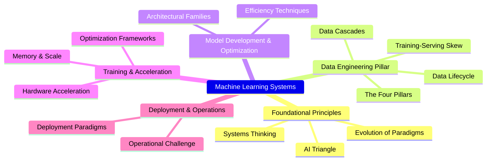
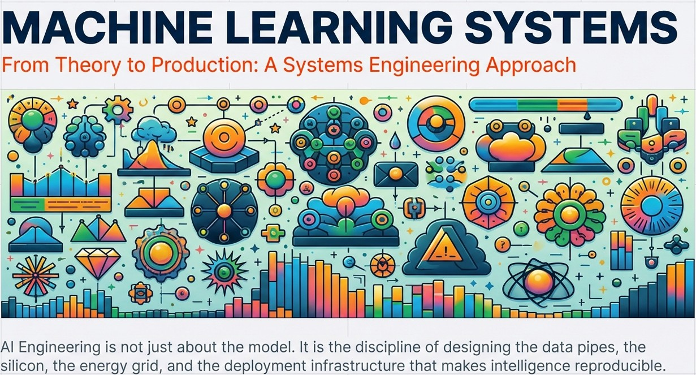
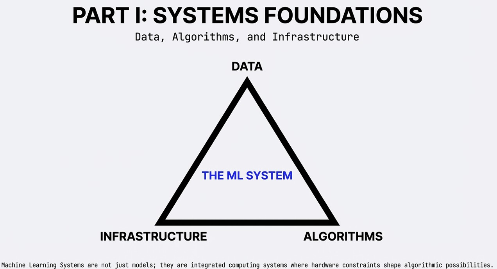
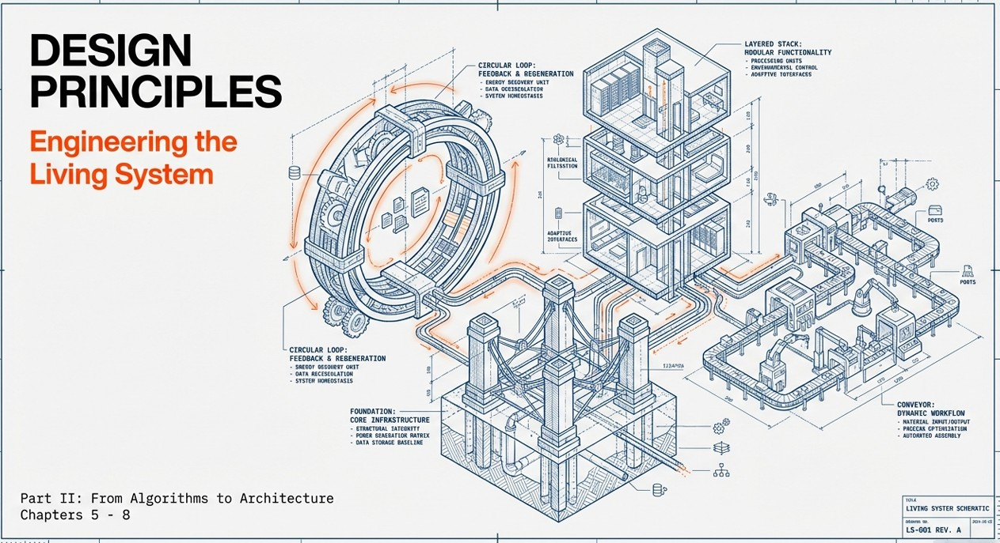

# Machine Learning Systems

## Table of Contents

- [Machine Learning Systems](#machine-learning-systems)
  - [Table of Contents](#table-of-contents)
  - [Machine Learning Systems Book](#machine-learning-systems-book)
    - [Part I: Systems Foundations](#part-i-systems-foundations)
      - [Chapter 1: Introduction](#chapter-1-introduction)
      - [Chapter 2: ML Systems](#chapter-2-ml-systems)
      - [Chapter 3: Deep Learning (DL) Primer](#chapter-3-deep-learning-dl-primer)
      - [Chapter 4: DNN Architectures](#chapter-4-dnn-architectures)
    - [Part II: Design Principles](#part-ii-design-principles)
      - [Chapter 5: AI Workflow](#chapter-5-ai-workflow)
      - [Chapter 6: Data Engineering](#chapter-6-data-engineering)
      - [Chapter 7: AI Frameworks](#chapter-7-ai-frameworks)
      - [Chapter 8: AI Training](#chapter-8-ai-training)
    - [Part III: Performance Engineering](#part-iii-performance-engineering)
      - [Chapter 9: Efficient AI](#chapter-9-efficient-ai)
      - [Chapter 10: Model Optimizations](#chapter-10-model-optimizations)
      - [Chapter 11: AI Acceleration](#chapter-11-ai-acceleration)
      - [Chapter 12: Benchmarking AI](#chapter-12-benchmarking-ai)
    - [Part IV: Robust Deployment](#part-iv-robust-deployment)
      - [Chapter 13: ML Operations](#chapter-13-ml-operations)
      - [Chapter 14: On-Device Learning](#chapter-14-on-device-learning)
      - [Chapter 15: Security \& Privacy](#chapter-15-security--privacy)
      - [Chapter 16: Robust AI](#chapter-16-robust-ai)
    - [Part V: Trustworthy Systems](#part-v-trustworthy-systems)
      - [Chapter 17: Responsible AI](#chapter-17-responsible-ai)
      - [Chapter 18: Sustainable AI](#chapter-18-sustainable-ai)
      - [Chapter 19: AI for Good](#chapter-19-ai-for-good)
    - [Part VI: Frontiers](#part-vi-frontiers)
      - [Chapter 20: AGI Systems](#chapter-20-agi-systems)
      - [Chapter 21: Conclusion](#chapter-21-conclusion)
  - [NotebookLM](#notebooklm)
    - [MindMap](#mindmap)
    - [Machine Learning Systems PDF](#machine-learning-systems-pdf)
    - [ML\_Systems\_Part1\_AI\_Systems\_Engineering](#ml_systems_part1_ai_systems_engineering)
    - [ML\_Systems\_Part2\_Engineering\_the\_Living](#ml_systems_part2_engineering_the_living)
  - 
  - [References](#references)

## Machine Learning Systems Book

The textbook Machine Learning Systems by Prof. Vijay Janapa Reddi is organized into 21 chapters, structured across six parts:

---

### Part I: Systems Foundations

#### Chapter 1: Introduction

- **The Paradigm Shift:** Machine learning represents a transformation where system behavior emerges from **data** rather than explicit programmed instructions.
- **Defining ML Systems:** An ML system is an integrated computing system comprising three interdependent components: **data**, **algorithms**, and **computational infrastructure**.
- **Failure Modes:** Unlike traditional software that fails visibly (crashes), ML systems exhibit **silent performance degradation**, continuing to operate while accuracy declines due to data drift.
- **The Bitter Lesson:** History shows that domain-general methods leveraging massive **computation** consistently outperform approaches based on hand-crafted human expertise.

#### Chapter 2: ML Systems

- **Physical Constraints:** Deployment environments are shaped by laws like the **speed of light**, which creates unavoidable latency bottlenecks for centralized cloud services.
- **The Spectrum:** ML operates across a hierarchy from **Cloud ML** (massive scale, high latency) to **TinyML** (microwatts of power, extreme resource constraints).
- **Edge and Mobile ML:** These paradigms prioritize local processing to ensure **data privacy**, reduce latency for real-time tasks, and enable offline functionality.
- **Hybrid Architectures:** Modern systems often integrate multiple tiers, such as using **TinyML** for low-power wake-word detection and **Cloud ML** for heavy natural language processing.

#### Chapter 3: Deep Learning (DL) Primer

- **Hierarchical Representation:** Deep learning uses multi-layered neural networks to automatically learn **abstract patterns** directly from raw data.
- **Biological Inspiration:** Artificial neurons map to biological structures: dendrites function as **inputs**, synapses provide **connection weights**, and axons deliver the **output**.
- **The Learning Process:** Training involves **forward propagation** to generate predictions and **backpropagation** to adjust weights by calculating error gradients.
- **Training vs. Inference:** Inference is more efficient than training because it only requires forward passes, uses fixed parameters, and can operate with **reduced numerical precision**.

#### Chapter 4: DNN Architectures

- **Inductive Bias:** Architectural selection depends on matching the model's structural assumptions to the specific **data characteristics**.
- **Multi-Layer Perceptrons (MLPs):** These utilize **dense connectivity** and serve as universal function approximators for unstructured or tabular data.
- **Convolutional Neural Networks (CNNs):** These exploit **spatial locality** and parameter sharing to efficiently process grid-like data such as images.
- **Recurrent Neural Networks (RNNs):** These maintain **internal states** to model temporal dependencies in sequential data, though they face challenges with long-range information.
- **Transformers:** By using **attention mechanisms**, Transformers dynamically weight relationships across sequences, enabling massive parallelization and state-of-the-art performance in complex relational tasks.

---

### Part II: Design Principles

This presentation explores the structural composition of machine learning systems, examining how data pipelines, execution frameworks, and training processes interact to create production-ready AI.

#### Chapter 5: AI Workflow

It explores the six-stage ML lifecycle and highlights the fundamental differences from traditional software, emphasizing its iterative, feedback-driven nature.

**The Systematic Lifecycle of ML Systems**

- **ML vs. Traditional Software:** Unlike deterministic traditional software, ML development is an **iterative, experimental, and probabilistic process**.
- **The Six Core Lifecycle Stages:**
    1. **Problem Definition:** Translating business goals into learning objectives.
    2. **Data Collection & Preparation:** Assembling the necessary data resources.
    3. **Model Development & Training:** Designing architectures and running optimization loops.
    4. **Evaluation & Validation:** Rigorous testing against performance metrics.
    5. **Deployment & Integration:** Moving models into production environments (Cloud, Edge, or TinyML).
    6. **Monitoring & Maintenance:** Tracking performance to detect silent degradation like **data and model drift**.
- **Systems Thinking Patterns:** Success depends on managing **constraint propagation** (early decisions affecting later stages) and **multi-scale feedback loops**.
- **Key Insight:** Effective ML systems are not built through linear steps but through **continuous cycles** where production insights inform data and model refinements.

#### Chapter 6: Data Engineering

It details the "Four Pillars Framework" (Quality, Reliability, Scalability, and Governance) and explains the critical impact of "data cascades" and the architecture of data pipelines.

**The Technical Substrate of AI**

- **Data as a First-Class Citizen:** In ML systems, data determines behavior just as code does in traditional software.
- **The Four Pillars Framework:**
  - **Quality:** Accuracy and fitness for the intended task.
  - **Reliability:** Consistent operation and graceful failure handling.
  - **Scalability:** Handling growing data volumes and complexity.
  - **Governance:** Ensuring privacy, ethics, and regulatory compliance.
- **Data Cascades:** Poor quality in early stages amplifies downstream, potentially leading to **systemic model corruption** or project failure.
- **Data Pipeline Architecture:** Orchestrating sources, ingestion (Batch vs. Stream), processing, labeling, and storage.
- **Strategic Storage:** Selection depends on access patterns—**databases** for serving, **warehouses** for structured training, and **data lakes** for raw heterogeneous data.
- **Feature Stores:** A critical bridge that eliminates **training-serving skew** by providing a single source of truth for feature definitions.

#### Chapter 7: AI Frameworks

It examines the role of software abstractions like computational graphs and automatic differentiation, comparing major platforms like TensorFlow, PyTorch, and JAX.

**The Critical Abstraction Layer**

- **Role of Frameworks:** They transform abstract mathematical concepts into optimized, hardware-executable code.
- **Core Concepts:**
  - **Computational Graphs:** Representing models as Directed Acyclic Graphs (DAGs) to enable optimization.
  - **Static vs. Dynamic Graphs:** Static graphs (e.g., TensorFlow 1.x) offer global optimization; dynamic graphs (e.g., PyTorch) prioritize developer flexibility and debugging.
  - **Automatic Differentiation (Autograd):** The "intelligence" to traverse graphs and compute gradients efficiently.
- **Major Platforms:**
  - **TensorFlow:** Focuses on production-scale deployment and TFX pipelines.
  - **PyTorch:** Prioritizes research flexibility with an imperative, "Pythonic" style.
  - **JAX:** Built on functional programming and composable transformations (vmap, jit, grad).
- **Standardization:** **ONNX** provides a universal model format, enabling interoperability across different frameworks and hardware.

#### Chapter 8: AI Training

It covers the orchestration of training pipelines and various optimization strategies, ranging from single-machine techniques like mixed-precision to large-scale distributed training patterns.

**Orchestrating Optimization at Scale**

- **The Training System:** A framework to execute iterative parameter optimization while managing massive data movement and memory pressure.
- **Pipeline Architecture:** Coordinates the **data pipeline** (fetching/preprocessing), **training loop** (forward/backward passes), and **evaluation pipeline**.
- **Mathematical Bottlenecks:** Training is dominated by **dense matrix multiplications (GEMM)**, which account for 60-90% of training time.
- **Pipeline Optimizations:**
  - **Prefetching:** Overlapping data loading with computation to eliminate idle time.
  - **Mixed-Precision Training:** Using **FP16** for faster math and **FP32** for stability to reduce memory and time.
  - **Gradient Accumulation & Checkpointing:** Trading computation for memory to train larger models on smaller hardware.
- **Distributed Training Strategies:**
  - **Data Parallelism:** Replicating the model to process different data subsets.
  - **Model Parallelism:** Splitting a single model across multiple devices.
  - **Pipeline Parallelism:** processing microbatches through model stages concurrently.
- **Hardware Acceleration:** Leveraging GPUs, TPUs (systolic arrays), and FPGAs to meet the extreme computational demands of modern AI.

---

### Part III: Performance Engineering

I was unable to generate a visual slide deck for this request at this time. However, I have prepared a **comprehensive presentation outline** for **Part III: Performance Engineering** based on the sources, structured for a course setting.

#### Chapter 9: Efficient AI

- **The Efficiency Imperative:** Modern AI progress is driven by scaling, but brute-force scaling (e.g., GPT-3) incurs massive financial and environmental costs. Efficiency has moved from an afterthought to a fundamental discipline necessary for system feasibility.
- **AI Scaling Laws:** Performance follows predictable power-law relationships with **model size (N)**, **dataset size (D)**, and **compute budget (C)**. These laws help predict optimal resource allocation before expensive training runs begin.
- **The Efficiency Framework:** Coordinated optimization occurs across three pillars:
  - **Algorithmic Efficiency:** Maximizing performance per unit of computation through better model design.
  - **Compute Efficiency:** Maximizing hardware utilization and energy awareness.
  - **Data Efficiency:** Extracting maximum information from high-quality, curated datasets.
- **Trade-offs and Sustainability:** Efficiency optimization is context-dependent—cloud systems prioritize scalability, while edge and TinyML devices prioritize power and memory constraints. Efficiency creates a feedback loop with sustainability: efficient systems are more scalable, which incentivizes further sustainable design.

#### Chapter 10: Model Optimizations

- **Optimization Dimensions:** Optimizations address three layers: model representation (structure), numerical precision (data types), and hardware implementation (execution patterns).
- **Structural Optimization:**
  - **Pruning:** Removing redundant parameters that contribute minimally to accuracy. **Unstructured pruning** removes individual weights, while **structured pruning** eliminates entire neurons, channels, or layers for better hardware compatibility.
  - **Knowledge Distillation:** Training a small "student" model to mimic the softened probability distributions of a large "teacher" model, preserving accuracy with fewer parameters.
- **Numerical Precision (Quantization):**
  - **Post-Training Quantization (PTQ):** A low-cost method to convert trained models to lower-bit formats (e.g., INT8).
  - **Quantization-Aware Training (QAT):** Integrating quantization constraints into the training process to help the model adapt and minimize accuracy loss.
- **Architectural Efficiency:**
  - **Hardware-Aware Design:** Proactively designing architectures (like MobileNet) to match the constraints of target processors.
  - **Dynamic Computation:** Selectively reducing computation for "simple" inputs through early-exit branches or gating mechanisms.

#### Chapter 11: AI Acceleration

- **The Evolution of Specialization:** General-purpose CPUs are often only 5-10% utilized for ML workloads. Specialization evolved from math coprocessors to GPUs and now to domain-specific architectures like Google’s TPU.
- **AI Compute Primitives:** Specialized hardware targets the core patterns of neural networks: **vector operations** (SIMD/SIMT), **matrix operations** (GEMM), and **special function units (SFUs)** for non-linear activations like ReLU or Sigmoid.
- **AI Memory Systems:** The **"Memory Wall"** is the primary bottleneck—computation speed outpaces memory bandwidth. Energy costs for memory access are orders of magnitude higher than arithmetic, forcing designs to prioritize data reuse.
- **Hardware Mapping and Dataflow:**
  - **Mapping:** Assigning computations to hardware units via spatial allocation and temporal scheduling.
  - **Dataflow Strategies:** Patterns like **weight-stationary** or **activation-stationary** determine which data remains in local memory to minimize energy-intensive external fetches.
- **Compiler and Runtime Support:** ML compilers (like XLA or TensorRT) translate high-level graphs into hardware-specific plans via kernel fusion, memory planning, and scheduling.

#### Chapter 12: Benchmarking AI

- **Benchmarking Framework:** Evaluation requires standardized datasets, models, and metrics to ensure fair comparison across diverse systems .
- **Granularity:** Benchmarks range from **micro** (primitive operations) to **macro** (full models) and **end-to-end** (full application pipelines) .
- **Standardization via MLPerf:** The industry standard for evaluating ML systems, covering both training and inference performance and including power measurement protocols .
- **Limitations:** Performance often gaps between controlled laboratory settings and real-world deployment due to factors like data drift and hardware heterogeneity .

---

### Part IV: Robust Deployment

This part of the course focuses on the transition from research models to **production-ready systems**, emphasizing the engineering required to ensure reliability, security, and performance in the real world.

#### Chapter 13: ML Operations

**Orchestrating the Production Lifecycle**

- **Defining MLOps:** MLOps is the evolution of **DevOps** specifically for machine learning, addressing the unique need to manage both code and **evolving data**.
- **The Problem of Technical Debt:** ML systems are prone to **hidden technical debt**, such as **boundary erosion** (where changes in one part affect others unexpectedly) and **correction cascades** (where models built on top of other models create fragile dependencies).
- **Probabilistic Monitoring:** Unlike traditional software that fails visibly, ML systems require monitoring for **silent degradation**, tracking metrics like **data drift** and **prediction distributions** rather than just system uptime.
- **Operational Maturity:** Organizations must progress through maturity levels, moving from manual, script-driven deployments to **fully automated continuous integration and deployment (CI/CD)** pipelines that validate data quality and model performance.

#### Chapter 14: On-Device Learning

**Personalization and Privacy at the Edge**

- **The Paradigm Shift:** On-device learning moves training from centralized cloud servers to **local hardware**, allowing models to adapt directly to individual user behavior.
- **Key Benefits:** This approach provides **data sovereignty** for privacy, enables **offline functionality**, and delivers **immediate responsiveness** by eliminating network latency.
- **Resource Constraints:** Edge deployment faces severe **design constraints**, including limited **memory capacity**, strict **battery power budgets**, and **thermal throttling** on mobile processors.
- **Federated Learning:** This collaborative technique allows a global model to be trained across **millions of decentralized devices** without ever centralizing raw user data, using local updates to refine a shared global model.

#### Chapter 15: Security & Privacy

**Defending the ML Stack**

- **The Threat Landscape:** ML systems introduce unique **model-specific attack vectors**, including **model theft** (reverse-engineering weights), **data poisoning** (corrupting training sets), and **adversarial attacks** (maliciously crafted inputs).
- **Hardware Vulnerabilities:** Security extends to the physical layer, where attackers may exploit **hardware bugs**, **side-channel attacks** (measuring power or timing), or **fault injection** to compromise system integrity.
- **Privacy-Preserving Techniques:** Robust systems utilize **Differential Privacy** to add calibrated noise to datasets, ensuring individual training examples cannot be extracted from the final model.
- **Layered Defense:** Effective security requires a **comprehensive defense architecture** spanning secure model design, runtime system monitoring, and hardware security foundations.

#### Chapter 16: Robust AI

**Ensuring System Reliability**

- **Defining Robustness:** A robust AI system maintains **reliability and safety** even when encountering hardware errors, malicious inputs, or unexpected changes in the operating environment.
- **The Three Pillars of Robust AI:**
    1. **Hardware Faults:** Managing **transient** (temporary), **permanent** (hardware failure), and **intermittent** faults that can lead to incorrect model outputs.
    2. **Intentional Input Manipulation:** Defending against **adversarial perturbations** and **data poisoning** attempts meant to trick the model.
    3. **Environmental Shifts:** Detecting and adapting to **distribution shift** and **concept drift**, where the data the model sees in production no longer matches its training data.
- **Evaluation Tools:** Robustness is measured through **fault injection frameworks** and automated stress testing to identify and mitigate failures before they impact the end user.

---

### Part V: Trustworthy Systems

This outline covers Chapters 17, 18, and 19, focusing on the ethical, environmental, and societal responsibilities of ML systems engineering.

#### Chapter 17: Responsible AI

**Integrating Ethics into the Engineering Lifecycle**

- **Beyond Accuracy:** Responsible AI shifts the focus from purely technical metrics to the **social and ethical implications** of system behavior.
- **Core Principles:**
  - **Transparency and Explainability:** Moving away from "black box" models to systems where stakeholders can understand and contest decisions.
  - **Fairness:** Implementing technical methods for **bias detection and risk mitigation** to prevent discriminatory outcomes across different demographic groups.
  - **Privacy:** Utilizing architectures like **Differential Privacy** to ensure individual data points cannot be extracted from trained models.
  - **Safety and Robustness:** Ensuring systems remain reliable under adversarial conditions or environmental shifts.
- **Accountability:** Establishing governance structures that assign responsibility for system outcomes throughout the entire lifecycle.

#### Chapter 18: Sustainable AI

**Addressing the Environmental Footprint of Scaling**

- **The Sustainability Crisis:** The exponential growth in model size has led to massive energy consumption and significant **carbon footprints**.
- **Environmental Impact Assessment:**
  - **Energy Consumption:** Analyzing the power usage effectiveness (PUE) of data centers and the total MWh required for training large-scale foundation models.
  - **Resource Depletion:** Considering the lifecycle effects of hardware, including **water usage** for cooling, hazardous chemicals in manufacturing, and the accumulation of **e-waste**.
- **Implementation Solutions:**
  - **Infrastructure Optimization:** Utilizing specialized hardware and efficient dataflow strategies to reduce the energy cost per operation.
  - **Lifecycle-Aware Development:** Implementing multi-layer mitigation strategies that consider environmental impact from the initial design phase through to disposal.

#### Chapter 19: AI for Good

**ML Systems for Global Societal Benefit**

- **The SDG Framework:** Aligning AI development with the **United Nations Sustainable Development Goals** to address global challenges in agriculture, healthcare, and environmental conservation.
- **Deployment Under Extreme Constraints:**
  - **Resource Paradox:** Developing high-performance systems for environments with **limited connectivity**, unreliable power, and low-cost hardware.
  - **Data Scarcity:** Engineering models that can learn effectively from small or noisy datasets typical of field deployments in developing regions.
- **Design Patterns for Social Impact:**
  - **Progressive Enhancement:** Designing systems that provide basic functionality offline or on low-power devices while enhancing capabilities when resources are available.
  - **Community Ownership:** Ensuring long-term viability by building systems that local communities can maintain and adapt.
- **Avoiding Extractive Relationships:** Prioritizing ethical data sourcing and ensuring that the benefits of AI are shared equitably with the communities that provide the training data.

---

### Part VI: Frontiers

This final part of the course explores the transition from specialized machine learning to **Artificial General Intelligence (AGI)** and synthesizes the core engineering principles required to build the future of intelligent systems.

#### Chapter 20: AGI Systems

**Engineering the Path to General Intelligence**

- **From Specialization to Generality:** While current AI excels at narrow, specific tasks (e.g., image recognition or translation), **AGI** aims for systems capable of human-like reasoning, adaptation, and problem-solving across diverse domains.
- **Intelligence as a Systems Problem:** Rather than just a larger model, AGI is viewed as an integration challenge requiring:
  - **The Scaling Hypothesis:** The belief that increasing compute, data, and parameters leads to emergent intelligence.
  - **Hybrid Neurosymbolic Architectures:** Combining the pattern recognition of neural networks with the logic of symbolic AI.
  - **Embodied Intelligence:** Systems that learn through physical or simulated interaction with an environment.
- **Compound AI Systems:** A framework where intelligence emerges from orchestrating multiple specialized models and tools rather than a single monolithic network.
- **Alternative Architectures:**
  - **State Space Models:** Efficiently processing extremely long contexts.
  - **World Models:** Predictive learning where models build internal simulations of reality.
- **Persistent Technical Barriers:**
  - **Context and Memory:** Managing massive context windows effectively.
  - **Energy Efficiency:** Reducing the astronomical computational costs of AGI-scale training.
  - **AI Alignment:** Ensuring system goals remain strictly aligned with human values.

#### Chapter 21: Conclusion

**Synthesizing the Journey of ML Systems Engineering**

- **The Discipline of AI Engineering:** Defined as the systems-level integration of algorithms, data, and infrastructure to build reliable, efficient, and scalable production systems.
- **Enduring Systems Principles:**
  - **Hardware-Software Co-Design:** Success depends on matching algorithmic patterns (like matrix multiplication) to specialized hardware (like GPUs/TPUs).
  - **The AI Triangle:** Every decision must balance the interdependent needs of **data, algorithms, and infrastructure**.
  - **Iterative Lifecycle:** ML engineering is not linear; it requires continuous feedback loops across data preparation, training, evaluation, and monitoring.
- **Navigating Production Reality:** Moving beyond research benchmarks requires addressing "silent failures," data drift, and the physical constraints of deployment environments—from the Cloud to TinyML.
- **Future Directions:**
  - **Sustainable AI:** Making scaling environmentally viable through lifecycle-aware development.
  - **Robust and Trustworthy AI:** Defending against adversarial attacks and ensuring fairness and transparency in automated decisions .
  - **AI for Good:** Applying these systems-level principles to solve global challenges in healthcare, agriculture, and conservation .
- **The Journey Forward:** ML systems engineers are the architects of the 21st century, transforming today’s autonomous visions into reliable, production-grade reality.

---

## NotebookLM

### [MindMap](img/Machine_Learning_Systems_MindMap.png)

### Machine Learning Systems PDF

### ML_Systems_Part1_AI_Systems_Engineering

### ML_Systems_Part2_Engineering_the_Living

---

## References

1. https://mlsysbook.ai/book/assets/downloads/Machine-Learning-Systems.pdf
2. https://mlsysbook.ai/book/
