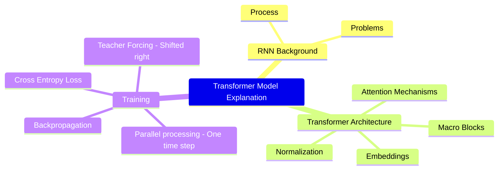
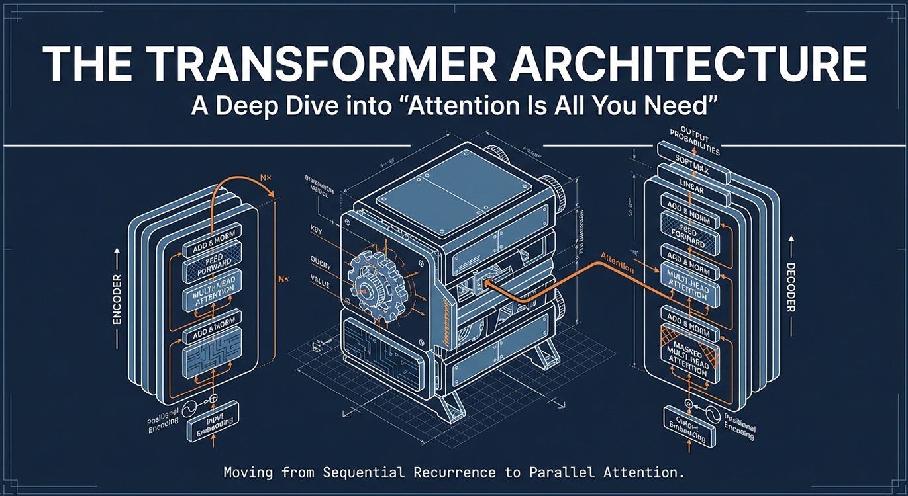

# Attention Is All You Need

This transcript provides a technical deep dive into the Transformer architecture, contrasting its parallel processing capabilities with the sequential limitations of Recurrent Neural Networks (RNNs). The source explains how Transformers utilize self-attention mechanisms to relate words across long distances, effectively solving the vanishing gradient problems found in older models. Key components such as positional encoding, multi-head attention, and layer normalization are detailed to show how data is transformed through the encoder and decoder blocks. The text further breaks down the mathematical operations of query, key, and value matrices which allow the model to focus on relevant context. Finally, it outlines the practical differences between training and inference, highlighting how the model processes entire sequences simultaneously during learning but generates tokens one by one during live translation.

## Table of Contents

- [Attention Is All You Need](#attention-is-all-you-need)
  - [Table of Contents](#table-of-contents)
  - [Attention Is All You Need (Transformer)](#attention-is-all-you-need-transformer)
    - [**Slide 1: Intro**](#slide-1-intro)
    - [**Slide 2: RNN and their problems**](#slide-2-rnn-and-their-problems)
    - [**Slide 3: Transformer Model Overview**](#slide-3-transformer-model-overview)
    - [**Slide 4: Maths Background and Notations**](#slide-4-maths-background-and-notations)
    - [**Slide 5: Encoder (Overview)**](#slide-5-encoder-overview)
    - [**Slide 6: Input Embeddings**](#slide-6-input-embeddings)
    - [**Slide 7: Positional Encoding**](#slide-7-positional-encoding)
    - [**Slide 8: Single Head Self-Attention**](#slide-8-single-head-self-attention)
    - [**Slide 9: Multi-Head Attention**](#slide-9-multi-head-attention)
    - [**Slide 10: Query, Key, Value (Q, K, V)**](#slide-10-query-key-value-q-k-v)
    - [**Slide 11: Layer Normalization**](#slide-11-layer-normalization)
    - [**Slide 12: Decoder (Overview)**](#slide-12-decoder-overview)
    - [**Slide 13: Masked Multi-Head Attention**](#slide-13-masked-multi-head-attention)
    - [**Slide 14: Training**](#slide-14-training)
    - [**Slide 15: Inference**](#slide-15-inference)
  - [NotebookLM](#notebooklm)
    - [MindMap](#mindmap)
    - [The Transformer Architecture](#the-transformer-architecture)
  - [Videos](#videos)
  - [References](#references)

## Attention Is All You Need (Transformer)

### **Slide 1: Intro**

- This presentation explores the **Transformer model**, an architecture that revolutionized sequence-to-sequence tasks.
- It serves as a comprehensive guide to understanding the model's structure, mathematical foundations, and operational mechanics.

### **Slide 2: RNN and their problems**

- **Recurrent Neural Networks (RNNs)** process sequences sequentially, requiring $n$ time steps for $n$ tokens.
- **Key Problems:**
    - **Slow for long sequences:** The sequential "for loop" nature makes training inefficient.
    - **Vanishing/Exploding Gradients:** Long chains of multiplication in the computation graph cause gradients to become too small or too large.
    - **Long-term Dependencies:** RNNs struggle to access information from distant previous tokens because their contribution fades over time.

### **Slide 3: Transformer Model Overview**

- The Transformer solves RNN limitations by using **parallelization** instead of sequential processing.
- It is divided into two macro blocks: the **Encoder** and the **Decoder**.
- These blocks are connected, with the encoder's output serving as input to the decoder.

### **Slide 4: Maths Background and Notations**

- The model relies heavily on **matrix multiplication** and **dot products**.
- Words are represented as vectors of size **$D_{model}$** (typically 512).
- If we multiply a sequence matrix (e.g., 6x512) by its transpose (512x6), we get a **score matrix** (6x6) representing word interactions.

### **Slide 5: Encoder (Overview)**

- The Encoder's job is to process the input sentence into a continuous representation.
- It consists of **Input Embeddings**, **Positional Encoding**, and multiple layers of **Multi-Head Attention** and **Feed-Forward** networks.

### **Slide 6: Input Embeddings**

- Sentences are **tokenized** into single words or sub-words.
- Tokens are mapped to **Input IDs** based on a fixed vocabulary.
- Input IDs are converted into vectors of size 512 ($D_{model}$). These values are **learnable parameters** that change during training to capture word meanings.

### **Slide 7: Positional Encoding**

- Since Transformers process all words simultaneously, they lack inherent information about word order.
- **Positional Encoding** adds fixed vectors (computed using **sine and cosine functions**) to the embeddings to represent the word's position in the sentence.
- This allows the model to learn patterns based on relative and absolute positions.

### **Slide 8: Single Head Self-Attention**

- **Self-attention** relates words within the same sentence to one another to capture context.
- It uses the formula: $Attention(Q, K, V) = \text{softmax}(\frac{QK^T}{\sqrt{d_k}})V$.
- It is **permutation invariant**, meaning the output values for a word don't change based on its position, only their location in the output matrix changes.

### **Slide 9: Multi-Head Attention**

- Instead of one attention pass, the model splits the $D_{model}$ into **multiple heads** (e.g., 8 heads of size 64).
- Each head watches the full sentence but focuses on **different aspects** of the embeddings (e.g., one head might focus on nouns, another on verbs).
- The results of all heads are **concatenated** and projected back to the original dimension.

### **Slide 10: Query, Key, Value (Q, K, V)**

- These terms come from **database terminology**.
- **Query (Q):** What the word is looking for.
- **Key (K):** What the word contains (to be matched against the Query).
- **Value (V):** The actual information the word provides once a match is found.

### **Slide 11: Layer Normalization**

- **Layer Normalization** is applied to each item in a batch independently.
- It calculates the mean and variance for an item's features and normalizes them to a range.
- It uses learnable parameters **$\gamma$ (gamma)** and **$\beta$ (beta)** to amplify or suppress specific values.

### **Slide 12: Decoder (Overview)**

- The Decoder generates the output sequence (e.g., a translation).
- It contains **Masked Multi-Head Attention** (for its own input) and **Cross-Attention** (where it uses keys/values from the encoder and queries from itself).

### **Slide 13: Masked Multi-Head Attention**

- To maintain **causality**, the decoder must not "see" future words during training.
- This is achieved by adding **minus infinity** to future word scores before the softmax, which turns them into **zeros**.
- This ensures the output at a certain position only depends on previous words.

### **Slide 14: Training**

- Training happens in **one time step** (parallel).
- Special tokens like **SOS (Start of Sentence)** and **EOS (End of Sentence)** help the model identify boundaries.
- The model compares its output against a **label (Target)** using **Cross-Entropy Loss** and backpropagates the error.

### **Slide 15: Inference**

- Unlike training, inference happens **token by token** (step-by-step).
- The encoder output is calculated only once.
- The decoder is fed the previous outputs at each step until an **EOS token** is generated.
- **Strategies:** **Greedy Search** (taking the most likely word) or **Beam Search** (tracking multiple probable sequences for better accuracy).

---

## NotebookLM

### [MindMap](img/Architectural_Taxonomy_Transformer_Models_MindMap.png)

### The Transformer Architecture

---

## Videos

 * [Attention is all you need (Transformer) - Model explanation (including math), Inference and Training](https://www.youtube.com/watch?v=bCz4OMemCcA)
	> 

---

## References

1. https://arxiv.org/abs/1706.03762
2. https://proceedings.neurips.cc/paper_files/paper/2017/file/3f5ee243547dee91fbd053c1c4a845aa-Paper.pdf
3. https://github.com/hkproj/transformer-from-scratch-notes
4. 