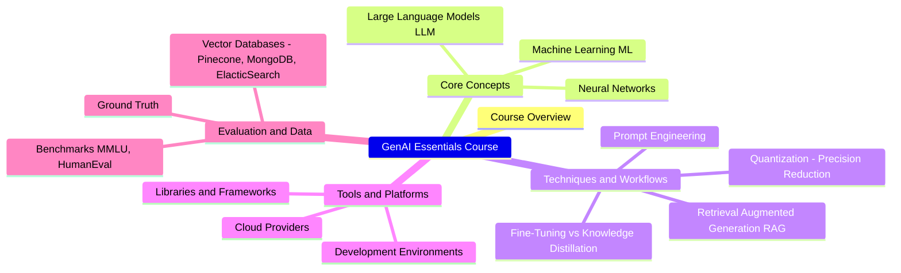
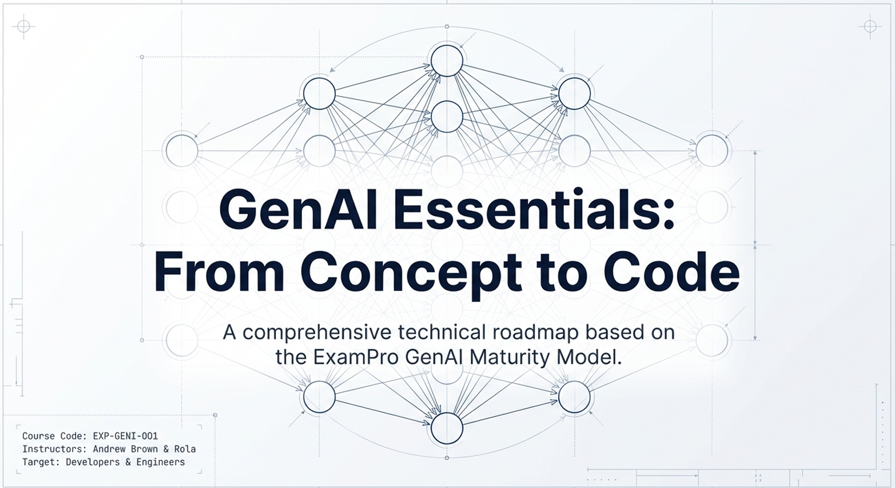

# GenAI Essentials – Full Course for Beginners

## Table of Contents

- [GenAI Essentials – Full Course for Beginners](#genai-essentials--full-course-for-beginners)
  - [Table of Contents](#table-of-contents)
  - [GenAI Essentials](#genai-essentials)
    - [**00:00:00 Introduction**](#000000-introduction)
    - [**00:54:16 AI and ML Fundamentals**](#005416-ai-and-ml-fundamentals)
    - [**03:02:21 Gen AI Primer**](#030221-gen-ai-primer)
    - [**03:32:55 Data and ML**](#033255-data-and-ml)
    - [**03:47:56 LLM Basics**](#034756-llm-basics)
    - [**04:12:22 AI Powered Assistants**](#041222-ai-powered-assistants)
    - [**04:24:42 Env Setup**](#042442-env-setup)
    - [**06:12:17 Prompt Engineering**](#061217-prompt-engineering)
    - [**07:00:25 WorkBenches and Playgrounds**](#070025-workbenches-and-playgrounds)
    - [**07:44:09 Model as a Service (MaaS)**](#074409-model-as-a-service-maas)
    - [**08:36:26 LLM DevTools and Workflow**](#083626-llm-devtools-and-workflow)
    - [**11:52:07 AI Code Assistants**](#115207-ai-code-assistants)
    - [**14:04:37 App Prototyping**](#140437-app-prototyping)
    - [**17:21:06 Containers**](#172106-containers)
    - [**18:12:43 Serving**](#181243-serving)
    - [**18:19:51 AI Delivery Platform**](#181951-ai-delivery-platform)
    - [**19:40:45 GenAI Hardware**](#194045-genai-hardware)
    - [**19:50:21 Framework**](#195021-framework)
    - [**19:51:49 LLM Customization**](#195149-llm-customization)
    - [**19:52:35 SFT (Supervised Fine-Tuning)**](#195235-sft-supervised-fine-tuning)
    - [**19:56:25 Size Optimization**](#195625-size-optimization)
    - [**20:26:04 RAGS (Retrieval Augmented Generation)**](#202604-rags-retrieval-augmented-generation)
    - [**22:21:19 Agents**](#222119-agents)
  - [Comments](#comments)
    - [**Foundations and Model Internals**](#foundations-and-model-internals)
    - [**The Role of LangChain and LlamaIndex**](#the-role-of-langchain-and-llamaindex)
    - [**Focus on Implementation (DevOps and Web Dev)**](#focus-on-implementation-devops-and-web-dev)
    - [**"Vibe Coding" vs. Practical Knowledge**](#vibe-coding-vs-practical-knowledge)
  - [NotebookLM](#notebooklm)
    - [MindMap](#mindmap)
    - [GenAI Essentials: From Concept to Code](#genai-essentials-from-concept-to-code)
  - [Video](#video)
  - [References](#references)

This comprehensive course presentation follows your specified contents, drawing from the provided sources to explain the evolution of Artificial Intelligence (AI), Machine Learning (ML), and Generative AI (GenAI).

---

## GenAI Essentials

This transcript provides a comprehensive look at the GenAI Essentials course, which aims to provide students with a broad foundational knowledge of generative AI. The curriculum covers a wide array of technical topics, including machine learning categories, the Transformer architecture, and specific models like Google’s BERT. Students are introduced to the practical side of AI development through demonstrations of cloud-based environments like AWS Bedrock, Azure AI Foundry, and Google Vertex AI. The sources also highlight various development tools and frameworks, such as Hugging Face pipelines, Ollama for local model serving, and Streamlit for building user interfaces. Furthermore, the material explores advanced prompting techniques like Tree of Thought and the utilization of vector databases for Retrieval-Augmented Generation (RAG). Ultimately, the course serves as a practical guide for beginners to navigate the rapidly evolving landscape of AI engineering.

### **00:00:00 Introduction**

- **Purpose:** This course provides comprehensive knowledge to start building generative AI applications and serves as a prerequisite for more advanced Hands-on projects.
- **Practical Focus:** The certification (EXP GENI 001) is cloud-vendor agnostic, covering fundamental concepts of ML, AI, and GenAI across all modalities.
- **The Maturity Model:** The course uses a "maturity model" to help practitioners navigate the rapidly evolving GenAI roadmap, from basic assistants to advanced agentic workflows.

### **00:54:16 AI and ML Fundamentals**

- **Definitions:**
  - **AI:** Machines performing jobs that mimic human behavior.
  - **ML:** Machines that get better at tasks without explicit programming.
  - **Deep Learning:** Systems using artificial neural networks inspired by the human brain.
- **Learning Types:**
  - **Supervised:** Task-driven; uses labeled data (e.g., Classification, Regression).
  - **Unsupervised:** Data-driven; discovers patterns in unlabeled data (e.g., Clustering).
  - **Reinforcement:** Decision-driven; an agent learns via trial-and-error feedback from an environment.
- **Neural Network Mechanics:** Data flows through weighted connections between neurons across hidden layers. **Activation Functions** (like ReLU, Sigmoid, and Softmax) act as gates to determine if a node "fires".

### **03:02:21 Gen AI Primer**

- **Definition:** A specialized subset of AI focused on creating novel, realistic content.
- **Modalities:** GenAI extends beyond text to include image, video, audio, 3D, and even molecular data for drug discovery.
- **Simulation vs. Emulation:** AI simulates (mimics) human behavior but does not currently emulate (perfectly replicate) the mechanisms of a virtual human brain.

### **03:32:55 Data and ML**

- **The Bread and Butter:** Data is essential for learning; foundational models are trained on amounts of data that would take a human 20,000 years to read.
- **Lifecycle:** Includes **Data Mining** (extracting patterns), **Wrangling** (cleaning and formatting), and **Modeling** (standardizing relationships).
- **Data Sets:** Divided into Training (learning), Validation (hyperparameter tuning), and Test (unbiased final evaluation) sets.

### **03:47:56 LLM Basics**

- **Transformer Architecture:** The core of modern LLMs, utilizing **Encoder** (understanding) and **Decoder** (generating) components.
- **Tokenization:** Breaking text into smaller units (tokens) matching a model's internal vocabulary.
- **Embeddings:** Representing data as vectors in a high-dimensional space to find contextual relationships.
- **Attention Mechanisms:** Allows models to highlight the importance of specific words relative to others in a sequence.

### **04:12:22 AI Powered Assistants**

- **Entry Points:** Common tools include **ChatGPT**, **Gemini**, **Claude**, **Meta AI**, and **Mistral**.
- **Functionality:** These assistants often have "bells and whistles," such as voice features, project management, or the ability to parse large PDFs.

### **04:24:42 Env Setup**

- **Environment Management:** Using **Conda** to create isolated Python environments to avoid library conflicts.
- **Authoring Tools:** **Jupyter Notebooks** and **Jupyter Lab** for combining live code with narrative text.
- **Cloud IDEs:** Options include **Google Colab**, **SageMaker Studio Lab**, **Lightning AI**, and **GitHub Codespaces**.

### **06:12:17 Prompt Engineering**

- **Techniques:** 
  - **Zero-shot:** Tasking the model with no prior examples.
  - **Few-shot (In-Context Learning):** Providing a few examples within the prompt.
  - **Chain of Thought:** Instructing the model to reason step-by-step.
  - **Tree of Thought:** Exploring multiple reasoning branches simultaneously.
- **Frameworks:** **CO-STAR** (Context, Objective, Style, Tone, Audience, Response) provides a structured template for better results.

### **07:00:25 WorkBenches and Playgrounds**

- **The Next Step:** Moving beyond consumer assistants to professional environments with "knobs" like **Temperature** and **Top K** to control output randomness.
- **Key Platforms:** OpenAI Playground, Anthropic Workbench, and Google AI Studio.

### **07:44:09 Model as a Service (MaaS)**

- **Unified Access:** Accessing multiple models via a single API through providers like **Amazon Bedrock**, **Azure AI Foundry**, and **Google Vertex AI**.

### **08:36:26 LLM DevTools and Workflow**

- **Hugging Face:** Acts as the "GitHub" of the AI world, hosting models and data sets.
- **Orchestration:** Tools like **LangChain** and **LlamaIndex** help build complex workflows, though many practitioners now prefer writing manual code for production stability.

### **11:52:07 AI Code Assistants**

- **Development Tools:** Specialized agents like **GitHub Copilot**, **Amazon Q Developer**, **Cursor**, and **Windsurf** that assist in writing, debugging, and explaining code.

### **14:04:37 App Prototyping**

- **Rapid UI:** Using **Streamlit**, **Gradio**, or **FastHTML** to build interfaces for Python-based AI models in minutes.
- **No-Code/Low-Code:** Tools like **v0** and **Lovable** can generate entire front-end and back-end applications from prompts.

### **17:21:06 Containers**

- **Sandboxing:** Isolating GenAI workloads to prevent resource exhaustion and manage dependencies.
- **OPEA:** An open platform providing blueprints for deploying AI microservices using Docker and Kubernetes.

### **18:12:43 Serving**

- **Inference Engines:** Serving models via **vLLM**, **TGI** (Text Generation Interface), or **Ray** for distributed workloads across multiple machines.

### **18:19:51 AI Delivery Platform**

- **Cloud Ecosystems:** Specialized platforms like **Intel Tyber AI Cloud**, **RunPod**, and **Cloudflare Workers AI** offer unique hardware and serverless environments for model delivery.

### **19:40:45 GenAI Hardware**

- **Processors:** **TPUs** (Google), **Habana Gaudi** (Intel), and **NVIDIA GPUs** using **CUDA** for parallel computation.
- **Edge Computing:** **iGPUs** and **NPUs** allow GenAI to run locally on laptops and mobile devices.

### **19:50:21 Framework**

- **Core Libraries:** **TensorFlow** (Google) and **PyTorch** (Meta) are the low-level frameworks used to build and train neural networks.

### **19:51:49 LLM Customization**

- **Weights and Parameters:** Models are sized by parameters; a 7 billion parameter model has 7 billion tunable "knobs".
- **Checkpoints:** The saved state of a model's weights after training.

### **19:52:35 SFT (Supervised Fine-Tuning)**

- **Definition:** Retraining pre-trained model weights on a smaller, labeled dataset.
- **Techniques:** Includes **LoRA** (Low-Rank Adaptation) and **PEFT** (Parameter-Efficient Fine-Tuning), which update only a small subset of parameters to save cost.

### **19:56:25 Size Optimization**

- **Quantization:** Reducing weight precision (e.g., from 32-bit float to 8-bit integer) to shrink memory footprint and speed up inference.
- **Knowledge Distillation:** Transferring knowledge from a large "teacher" model to a smaller "student" model.

### **20:26:04 RAGS (Retrieval Augmented Generation)**

- **Contextual Knowledge:** Improving LLM accuracy by retrieving relevant documents from an external **Vector Database** (like **Pinecone**, **Elastic**, or **MongoDB**) and providing them to the model.

### **22:21:19 Agents**

- **Agentic Workflows:** Autonomous systems that use LLMs to reason, use tools, and complete multi-step tasks.
- **Frameworks:** **CrewAI** and **OpenHands** (formerly OpenDevin) enable multiple specialized agents (e.g., Researcher, Writer, QA) to collaborate on complex projects.

## Comments

While the course has a strong focus on implementation and developer tools, the sources indicate that it aims to balance practical "how-to" knowledge with the theoretical foundations of Generative AI (GenAI) to prepare students for building real-world projects,.

Here is a breakdown of how the course addresses your concerns based on the provided material:

### **Foundations and Model Internals**
The course does include detailed sections on GenAI foundations and model internals. It covers:
*   **Transformer Architecture:** A breakdown of the core architecture, specifically exploring the **Encoder** and **Decoder** components,.
*   **Attention Mechanisms:** Technical explanations of **self-attention, cross-attention, and multi-head attention**,.
*   **Model Parameters and Weights:** Discussions on how models are sized by parameters and how weights are adjusted during training,.
*   **Quantization:** In-depth coverage of reducing model precision (e.g., from FP32 to INT8) to lower memory footprints and resource costs,.

### **The Role of LangChain and LlamaIndex**
Regarding your point on LangChain, the instructor explicitly mentions a deliberate choice to move away from these frameworks. They state that while LangChain was useful when LLMs had small context windows, they now find the documentation often out-of-date and the implementations lacking,. Instead, the course focuses on **programmatically working with LLMs** by writing the code "by hand" for better production stability,.

### **Focus on Implementation (DevOps and Web Dev)**
You are correct that there is a significant emphasis on implementation. The instructor acknowledges a **"developer background"** and a focus on **delivering workloads that are secure and in-budget**,. This includes:
*   **Environment Setup:** Heavily emphasizing tools like **Conda, Docker, and Jupyter** to manage local development,.
*   **App Prototyping:** Using libraries like **Streamlit and Gradio** to build user interfaces for AI models,,.
*   **Serving and Hardware:** Understanding how to run models on specific hardware, such as **Intel Xeon processors or edge devices** like NPUs and igpus, which is critical for the "constrained environments" you mentioned,,.

### **"Vibe Coding" vs. Practical Knowledge**
While the term "vibe coding" is not in the sources, the instructor describes this as a **"practical GenAI certification"**. They characterize the course as a **"maturity model"** designed to help students move beyond consumer-level assistants to professional **workbenches and programmatic implementation**,. The instructor admits the course is in a "beta" state and focuses on providing "broad knowledge" so practitioners can be successful regardless of their specific technical choice. 

In summary, the course is designed as a **prerequisite for a hands-on boot camp**. Its focus on "DevOps" (containers, environment management) and "Web Dev" (Streamlit, fast HTML) is intended to provide the necessary infrastructure skills to actually deploy the model internals it teaches,,.

---

## NotebookLM

### [MindMap](img/GenAI_Essentials_MindMap.png)

### GenAI Essentials: From Concept to Code

---

## Video

 * [GenAI Essentials – Full Course for Beginners](https://www.youtube.com/watch?v=nJ25yl34Uqw)
	> 

## References

