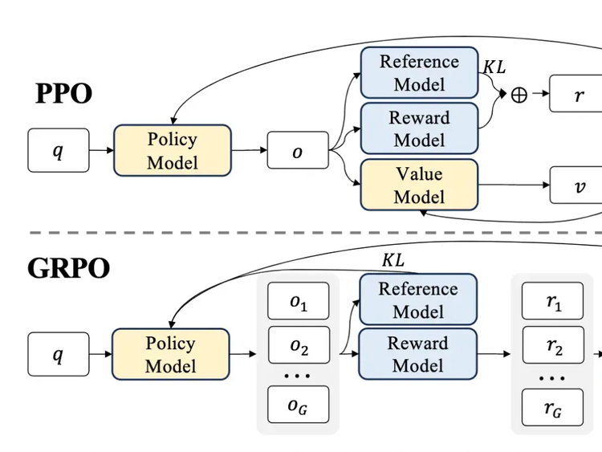

# Scaling law

## Table of Contents

- [Scaling law](#scaling-law)
	- [Table of Contents](#table-of-contents)
	- [Scaling laws in AI](#scaling-laws-in-ai)
		- [Key Aspects of Scaling Laws](#key-aspects-of-scaling-laws)
		- [Key Components in AI](#key-components-in-ai)
	- [The power law relationship](#the-power-law-relationship)
	- [Scaling Laws Are Unreliable for Downstream Tasks: A Reality Check](#scaling-laws-are-unreliable-for-downstream-tasks-a-reality-check)
	- [inference-time scaling](#inference-time-scaling)
		- [Key aspects of inference-time scaling include](#key-aspects-of-inference-time-scaling-include)
	- [Stages of ML Training Pipeline](#stages-of-ml-training-pipeline)
		- [pre-training](#pre-training)
		- [mid-training](#mid-training)
		- [pos-training](#pos-training)
		- [Videos](#videos)
	- [fine-tuning and the ## pre-training, mid-training, and post-training models](#fine-tuning-and-the--pre-training-mid-training-and-post-training-models)
	- [fine-tuning and Scaling Reinforcement Learning](#fine-tuning-and-scaling-reinforcement-learning)
	- [fine-tuning and the Reinforcement Learning with Human Feedback](#fine-tuning-and-the-reinforcement-learning-with-human-feedback)
	- [fine-tuning and the Reinforcement Learning with Human Feedback](#fine-tuning-and-the-reinforcement-learning-with-human-feedback-1)
	- [Reinforcement Learning with Verifiable Rewards (RLVR)](#reinforcement-learning-with-verifiable-rewards-rlvr)
		- [Key aspects of Reinforcement Learning with Verifiable Rewards include](#key-aspects-of-reinforcement-learning-with-verifiable-rewards-include)
	- [Reinforcement learning, actor and learner](#reinforcement-learning-actor-and-learner)
		- [Key Aspects of Actor-Learner Architecture](#key-aspects-of-actor-learner-architecture)
		- [Optimization Strategies:](#optimization-strategies)
	- [Supervised Fine-Tuning (SFT)](#supervised-fine-tuning-sft)
		- [Key Aspects of SFT](#key-aspects-of-sft)
		- [SFT vs. Other Approaches](#sft-vs-other-approaches)
		- [Common Use Cases](#common-use-cases)
	- [Direct Preference Optimization](#direct-preference-optimization)
		- [What is DPO and PPO?](#what-is-dpo-and-ppo)
	- ["Aha moments" in Large Language Models](#aha-moments-in-large-language-models)
		- [Core Concepts \& Origins](#core-concepts--origins)
		- [Mechanisms and Characteristics](#mechanisms-and-characteristics)
		- ["Aha Moments" as Real vs. Decorative](#aha-moments-as-real-vs-decorative)
		- [Applications and Impact](#applications-and-impact)
		- [The "Aha Framework" for Business](#the-aha-framework-for-business)
	- [Group Relative Policy Optimization (GRPO)](#group-relative-policy-optimization-grpo)
	- [The FLOPs Calculus of Language Model Training](#the-flops-calculus-of-language-model-training)
	- [Videos](#videos-1)
	- [References](#references)

## Scaling laws in AI

Scaling laws are power-law relationships, \(y=ax^{b}\), that describe how a system's performance improves as its size, data, or compute increases. In AI, they predict that increasing model parameters, dataset size, and compute leads to predictable, logarithmic improvements in test loss. They allow for optimizing training budgets.

### Key Aspects of Scaling Laws

- AI/Deep Learning: Neural scaling laws define how performance improves predictably with more compute, data, and parameters, often transitioning from random guessing to a power-law regime and finally a plateau.
- Three Main AI Laws: NVIDIA Blog identifies three key areas: pretraining (model size/data), post-training (fine-tuning), and test-time (inference computation).
- Prediction Tool: They are used to forecast the performance of larger, more expensive models without training them fully first.
- Physical Scaling: Beyond AI, these laws describe proportional relationships in physical systems (e.g., surface area vs. volume).

### Key Components in AI

- Compute: Total floating-point operations.
- Parameters (\(N\)): Number of weights in the model.
- Dataset Size (\(D\)): Amount of training data.

These laws, popularized for Large Language Models (LLMs) by arXiv, indicate that larger models trained on more data generally result in better performance following a predictable trend.

## The power law relationship

A **scaling law** is defined as the **power law relationship** between the resources used for a model (specifically a combination of **compute and data**) and the model's performance, measured as **held-out prediction accuracy** over next tokens. This relationship is considered a "definitional thing" because it is a **highly predictable** way to understand how increasing resources will translate into improved intelligence.

According to the sources, there are now **three primary axes** of scaling laws being utilized:

- **Pre-training Scaling:** The traditional approach of increasing the model size (parameters) and the amount of data (trillions of tokens) it is trained on.
- **Reinforcement Learning (RL) Scaling:** A newer focus where the model undergoes "trial and error" learning. For techniques like **Reinforcement Learning with Verifiable Rewards (RLVR)**, increasing training compute logarithmically results in a **linear increase** in performance on benchmarks.
- **Inference-Time Scaling:** Often referred to as "thinking" time, this law involves letting a model generate more tokens (hidden thoughts) for a specific query to achieve a "step function" increase in its reasoning abilities.

Experts in the sources note that these laws have remained remarkably stable, holding true across **13 orders of magnitude of compute**. While pre-training scaling has become extremely expensive—often requiring gigawatt-scale data centers—labs are increasingly looking to **inference and RL scaling** as more attractive, "low-hanging fruit" to gain performance in 2026.

## Scaling Laws Are Unreliable for Downstream Tasks: A Reality Check

In this AI Research Roundup episode, Alex discusses the paper:

'Scaling Laws Are Unreliable for Downstream Tasks: A Reality Check(2507.00885v1)'
This paper challenges the common belief that model performance on specific tasks predictably improves with scale, a concept known as "scaling laws." It investigates conflicting evidence, including phenomena like "inverse scaling" where bigger models perform worse. Through a meta-analysis, the authors find that a predictable linear improvement is surprisingly rare, occurring in only 39% of tasks. They demonstrate that factors like pretraining data and experimental setup can completely invalidate observed scaling trends. This research serves as a crucial reality check, suggesting that unpredictable scaling behavior is the norm for downstream tasks.

Paper URL: https://arxiv.org/pdf/2507.00885

## inference-time scaling

Inference-time scaling (or test-time scaling) refers to allocating more computational resources—such as time, memory, or processing power—during an AI model's inference phase to improve performance on complex tasks. Instead of relying solely on larger, pre-trained models, this technique enables smaller models to achieve superior results by encouraging them to think longer, explore multiple reasoning paths, and correct errors.

### Key aspects of inference-time scaling include

- Mechanisms: Techniques include Chain-of-Thought (CoT), Tree-of-Thought (ToT), search algorithms like Monte Carlo Tree Search (MCTS), and model ensembles.
- Benefits: It allows for better handling of complex reasoning, math, and coding tasks by enabling models to "deliberate" or "backtrack" when an initial path is unpromising.
- Efficiency: Smaller, open-source models (e.g., 7B parameters) can reach performance levels comparable to much larger models (like GPT-4) without additional training.
- Applications: Beyond LLMs, this approach is used in diffusion models for image generation, where increasing inference steps or using particle-based methods improves quality. 

This paradigm shift focuses on optimizing the "thought" process during generation rather than just pre-training, making AI more efficient and capable. 

## Stages of ML Training Pipeline

### pre-training

The initial phase where a model builds its general knowledge, linguistic fluency, and foundational representations via self-supervised learning on massive, diverse data.

### mid-training

An intermediate stage where the model is refined on curated, high-quality data to enhance specific reasoning or technical capabilities.

### pos-training

The final refinement and alignment phase that uses human feedback, verifiable rewards, and task-specific supervision to achieve robust reasoning and interactive behavior performance.

> To generalize, RL post-training is more like the skill unlock, where pre-training is like soaking up the knowledge essentially.
>
> Mid-training is being selective in terms of quality content at the end, so the last thing the LLM has seen is the quality stuff. And then post-training is all the fine-tuning: supervised fine-tuning, DPO, RLVR with human feedback and so forth. So, the refinement stages.

### Videos

How LLMs Are Actually Trained: Pre-Training vs. Post ...
YouTube · Super Data Science: ML & AI Podcast with Jon Krohn
Aug 13, 2025
YouTube · Super Data Science: ML & AI Podcast with Jon Krohn

5:04
Pre-training predicts the next word from vast data. Post-training uses methods like reinforcement learning to refine models for specific tasks.
On the Interplay of Pre-Training, Mid-Training, and RL on ...
YouTube · Xiaol.x
1 month ago
YouTube · Xiaol.x

13:54
Unlock AI reasoning with a 3-stage plan: broad pre-training (1% data is key), mid-training alignment, and strategic RL at the edge of competence.
On the Interplay of Pre-Training, Mid-Training, and RL on ...
YouTube · AI Papers Slop
Dec 9, 2025
YouTube · AI Papers Slop

16:09
RL delivers capability gains when trained on data at the model's edge of competence, boosting performance by up to 42% on hard tasks.

## fine-tuning and the ## pre-training, mid-training, and post-training models

Videos
How LLMs Are Actually Trained: Pre-Training vs. Post ...
YouTube · Super Data Science: ML & AI Podcast with Jon Krohn
Aug 13, 2025
YouTube · Super Data Science: ML & AI Podcast with Jon Krohn

5:04
Pre-training predicts the next word from vast data. Post-training uses methods like reinforcement learning to refine models for specific tasks.
On the Interplay of Pre-Training, Mid-Training, and RL on ...
YouTube · Xiaol.x
1 month ago
YouTube · Xiaol.x

13:54
Unlock AI reasoning with a 3-stage plan: broad pre-training (1% data is key), mid-training alignment, and strategic RL at the edge of competence.
On the Interplay of Pre-Training, Mid-Training, and RL on ...
YouTube · AI Papers Slop
Dec 9, 2025
YouTube · AI Papers Slop

16:09
RL delivers capability gains when trained on data at the model's edge of competence, boosting performance by up to 42% on hard tasks.

## fine-tuning and Scaling Reinforcement Learning

Videos
Fine-tuning & Reinforcement Learning for LLMs
YouTube · AMD Developer Central
Nov 10, 2025
YouTube · AMD Developer Central

13:50
RL is a powerful tool for training LLMs. It can be used to solve games, perform math, and automate AI research.
Build Hour: Reinforcement Fine-Tuning
YouTube · OpenAI
Sep 2, 2025
YouTube · OpenAI

59:48
Reinforcement fine-tuning improves reasoning models' performance. It's data-efficient, requires no manual labeling, and can be applied to policy compliance, legal reasoning, and medical coding.
Fine-Tuning Language Models with Reinforcement Learning ...
YouTube · O'Reilly
2 weeks ago
YouTube · O'Reilly

21:34
Fine-tuning large language models with reinforcement learning improves reliability and reduces costs. Start with proprietary models, then consider fine-tuning for better performance and control.

## fine-tuning and the Reinforcement Learning with Human Feedback

Videos
Fine-tuning LLMs on Human Feedback (RLHF + DPO)
YouTube · Shaw Talebi
Mar 3, 2025
YouTube · Shaw Talebi

28:53
Fine-tune LLMs on human feedback using RLHF or DPO. RLHF uses a reward model to predict human preferences, while DPO directly optimizes the model's parameters based on preference data.
Reinforcement Learning with Human Feedback (RLHF ...
YouTube · StatQuest with Josh Starmer
May 5, 2025
YouTube · StatQuest with Josh Starmer

18:02
RLHF uses human preferences to train a reward model, which then trains the original model to generate polite and helpful responses.
Reinforcement Learning with Human Feedback (RLHF) in 4 ...
YouTube · Sebastian Raschka
Feb 8, 2025
YouTube · Sebastian Raschka

4:06
RLHF is a three-step process: supervised fine-tuning, human ranking of responses, and training a reward model using reinforcement learning.Reinforcement Learning

Videos
Fine-tuning & Reinforcement Learning for LLMs
YouTube · AMD Developer Central
Nov 10, 2025
YouTube · AMD Developer Central

13:50
RL is a powerful tool for training LLMs. It can be used to solve games, perform math, and automate AI research.
Build Hour: Reinforcement Fine-Tuning
YouTube · OpenAI
Sep 2, 2025
YouTube · OpenAI

59:48
Reinforcement fine-tuning improves reasoning models' performance. It's data-efficient, requires no manual labeling, and can be applied to policy compliance, legal reasoning, and medical coding.
Fine-Tuning Language Models with Reinforcement Learning ...
YouTube · O'Reilly
2 weeks ago
YouTube · O'Reilly

21:34
Fine-tuning large language models with reinforcement learning improves reliability and reduces costs. Start with proprietary models, then consider fine-tuning for better performance and control.

## fine-tuning and the Reinforcement Learning with Human Feedback

Videos
Fine-tuning LLMs on Human Feedback (RLHF + DPO)
YouTube · Shaw Talebi
Mar 3, 2025
YouTube · Shaw Talebi

28:53
Fine-tune LLMs on human feedback using RLHF or DPO. RLHF uses a reward model to predict human preferences, while DPO directly optimizes the model's parameters based on preference data.
Reinforcement Learning with Human Feedback (RLHF ...
YouTube · StatQuest with Josh Starmer
May 5, 2025
YouTube · StatQuest with Josh Starmer

18:02
RLHF uses human preferences to train a reward model, which then trains the original model to generate polite and helpful responses.
Reinforcement Learning with Human Feedback (RLHF) in 4 ...
YouTube · Sebastian Raschka
Feb 8, 2025
YouTube · Sebastian Raschka

4:06
RLHF is a three-step process: supervised fine-tuning, human ranking of responses, and training a reward model using reinforcement learning.

## Reinforcement Learning with Verifiable Rewards (RLVR)

Reinforcement Learning with Verifiable Rewards (RLVR) is a highly effective training strategy for LLMs that replaces human-labeled data with automated, binary (0/1) signals to judge output accuracy, famously used in DeepSeek-R1. It is designed for structured tasks like mathematics and coding, allowing models to explore solutions and receive immediate, precise feedback, minimizing reward hacking. It is considered a key technique for accelerating reasoning capabilities.

### Key aspects of Reinforcement Learning with Verifiable Rewards include

- Mechanism: Instead of using a trained model to predict human preference (as in RLHF), RLVR uses deterministic, script-based verifiers (e.g., executing code, checking if a math answer matches) to provide a strict +1 for correct and 0 for incorrect.
- Algorithms: Commonly used alongside Group Relative Policy Optimization (GRPO), which computes baselines within a group of samples, avoiding the need for a separate critic network.
- Applications: Primarily used to enhance reasoning in LLMs, such as Chain of Thought (CoT) generation for competitive programming or math, and for training agents to follow procedural steps.
- Benefits & Challenges: Offers scalable, cost-effective, and high-quality training signals. However, it can face "reward hacking" (if the verifier is flawed) and requires careful, rigorous, and sanitized evaluation to avoid data contamination.
- Key Results: Models trained with RLVR, such as DeepSeek-R1 and Chart-RVR, show significant improvements in reasoning tasks and, in some cases, exceed the performance of models trained with traditional Supervised Fine-Tuning (SFT).

Videos
Experimenting with Reinforcement Learning with Verifiable ...
YouTube · Nathan Lambert
Apr 8, 2025
YouTube · Nathan Lambert

47:13
Experimenting with Reinforcement Learning with Verifiable Rewards (RLVR)
[UCLA RL-LLM] Chapter 3.2: Reinforcement learning with ...
YouTube · Ernest Ryu
Jul 10, 2025
YouTube · Ernest Ryu

1:01:58
RLVR (Reinforcement Learning with Verifiable Rewards) uses chain-of-thought reasoning to solve math problems and improve logical reasoning in large language models.
RLVR: Reinforcement Learning with Verifiable Rewards
YouTube · AI Makerspace
Aug 28, 2025
YouTube · AI Makerspace

1:04:28
We're going to talk about RLVR and understand what it is how it differs from other RL techniques including the OGs.

## Reinforcement learning, actor and learner

In reinforcement learning, the actor generates data by interacting with environments, while the learner (or learner GPU) updates the policy model using this data. To maximize efficiency, multiple actors (often on CPUs) feed experience to a single, high-performance GPU, which trains the model and periodically updates the actors.

### Key Aspects of Actor-Learner Architecture

- Asynchronous Actor-Critic (A3C): Actors run in parallel, pushing data to a centralized learner, reducing policy lag.
- GPU Utilization: Learners typically use GPU acceleration (e.g., CUDA) for high-throughput batch processing, particularly with large images or complex environments.
- Performance Bottleneck: A major challenge is the "actor-learner bottleneck," where actors cannot generate data fast enough to keep the learner GPU fully occupied, requiring careful tuning of CPU/GPU ratios.
- Modern Approaches: Modern setups like NVIDIA Isaac Gym allow for massively parallel, GPU-based simulation where both actors and the learner run on the GPU, significantly increasing training speed.
Frameworks: Libraries such as JAX and BRAX allow for end-to-end, high-performance GPU-based reinforcement learning.

### Optimization Strategies:

- Asynchronous Updates: Use asynchronous methods (like A3C or IMPALA) to prevent fast actors from waiting on slower, updating learners.
- Efficient Data Transfer: Minimize data transfer latency between CPUs (actors) and GPUs (learners).
- Parallelism: Use multiple GPUs to run multiple policies in parallel if necessary.

## Supervised Fine-Tuning (SFT)

Supervised Fine-Tuning (SFT) is a critical, initial post-training process that adapts pre-trained AI models to specific tasks or instruction-following behaviors using a curated, labeled dataset of examples. By training on high-quality input-output pairs (prompts and responses), SFT aligns models with desired tones, formats, and behaviors, typically acting as a precursor to reinforcement learning.

### Key Aspects of SFT

- Purpose: To transform a general-purpose base model into a specialized model that follows specific instructions and behaviors.
- Method: The model is trained on a smaller, high-quality, task-specific dataset, where it learns to predict the next token based on labeled examples, explains Sarah on BlueDot Impact blog.
- Data Quality: High-quality,, diverse examples are essential; as few as 50 to 1,000 examples can significantly improve model performance, says a YouTube video by Appen.
- Techniques:
  - Full Fine-Tuning: Updates all parameters, requiring high computational resources.
  - PEFT (Parameter-Efficient Fine-Tuning): Updates only a small subset of parameters (e.g., LoRA), which is more accessible and common, explains a YouTube video by Appen.

### SFT vs. Other Approaches

- SFT vs. Pre-training: Pre-training teaches general language, while SFT teaches specific skills.
- SFT vs. RAG: SFT shapes model behavior and style, whereas Retrieval-Augmented Generation (RAG) provides factual knowledge.
- SFT vs. RLHF/DPO: SFT is often the first step to teach format, followed by methods like DPO to further align with preferences.

### Common Use Cases

Instruction Following: Teaching models to act as chatbots or assistants, says a YouTube video by Appen.
Domain Adaptation: Specializing models for legal, financial, or medical document analysis.
Output Formatting: Ensuring consistent output formats like JSON or SQL.

## [Direct Preference Optimization](https://arxiv.org/abs/2305.18290)

Direct Preference Optimization (DPO) fine-tuning allows you to fine-tune models based on prompts and pairs of responses. This approach enables the model to learn from more subjective human preferences, optimizing for outputs that are more likely to be favored.

Direct preference optimization files have a different format than supervised fine-tuning. Customers provide a "conversation" containing the system message and the initial user message, and then "completions" with paired preference data. Users can only provide two completions.

### What is DPO and PPO?

DPO vs PPO: How To Align LLM
DPO (Direct Preference Optimization) and PPO (Proximal Policy Optimization) are two methods used to align Large Language Models (LLMs) with human preferences. DPO directly optimizes the model based on human feedback, while PPO is a reinforcement learning approach that iteratively improves the model's behavior.

## "Aha moments" in Large Language Models

"Aha moments" in Large Language Models (LLMs) refer to emergent, often spontaneous, moments of sudden insight, reflection, and self-correction that occur during training or inference, particularly in reasoning-heavy tasks. These moments are frequently associated with advanced reinforcement learning (RL) techniques, where models autonomously develop complex problem-solving strategies, such as backtracking or verifying intermediate steps.

Here is a breakdown of the key concepts surrounding "aha moments" in LLMs:

### Core Concepts & Origins

- Definition: A moment of sudden realization or "Eureka!" where the model recognizes an error in its current reasoning path and corrects it without explicit programming.
- Emergence in RL: These moments gained prominence with models like DeepSeek-R1-Zero, which used pure reinforcement learning on mathematical tasks, causing the model to develop reflection and self-correction strategies autonomously.
- Key Behavior: The "aha moment" is characterized by the model generating a "thought" block (like "Wait," "Let me re-evaluate") followed by a correction. 

### Mechanisms and Characteristics

- GRPO (Group Relative Policy Optimization): DeepSeek used GRPO, where the model generates multiple solutions for one prompt, allowing it to evaluate and select the best reasoning path, fostering better, self-correcting behavior.
- Increased Response Length: The development of "aha moments" is often accompanied by the model naturally increasing its chain-of-thought (CoT) length, allowing for more in-depth, "slow" thinking.
- Beyond Math: While initially identified in math/coding, these capabilities are being applied to social reasoning (Theory of Mind) and visual language models (VLMs).

### "Aha Moments" as Real vs. Decorative

Recent research has questioned whether all "aha moments" are genuine, or if they are "decorative" (post-hoc rationalization). 

- True Thinking Steps: Some steps are genuinely used to compute the final output.
- Decorative Steps: Many steps, including self-verification, may be "decorative," where the model generates a "Wait..." phrase but does not actually change its internal reasoning, resulting in minimal impact on the final answer.
- Steering: Researchers have identified a "TrueThinking" direction in the latent space, which can be used to steer models, forcing them to either actually perform or skip these self-verification steps. 

### Applications and Impact

- Improved Reasoning: The, "aha moment" phenomenon enables, smaller models (e.g., 7B parameters) to achieve performance comparable to larger models (e.g., o1-preview).
- Safety Improvements: These moments can be used to monitor and detect unsafe behaviors in the chain-of-thought.
- Visual Reasoning: "Aha moments" are being explored to help multimodal models (VLMs) self-correct visual, generation,, and comprehension tasks. 

### The "Aha Framework" for Business

Apart from the technical, definition, "Aha Moment" is also used in a, business context as a, framework to, identify, high-value, use cases for LLM agents, requiring them to be: Ambiguous, High-Volume, and Asymmetric in, upside. 

## Group Relative Policy Optimization (GRPO)

## The FLOPs Calculus of Language Model Training

## Videos

 * [Scaling Laws of AI explained | Dario Amodei and Lex Fridman](https://www.youtube.com/watch?v=GrloGdp5wdc)
	> 

 * [Are AI Scaling Laws dead? | Lex Fridman Podcast](https://www.youtube.com/watch?v=cTWRgnBm384)
	> 

 * [How Scaling Laws Will Determine AI's Future | YC Decoded](https://www.youtube.com/watch?v=d6Ed5bZAtrM)
	> 

* [GPUs, TPUs, & The Economics of AI Explained | Gavin Baker Interview](https://www.youtube.com/watch?v=cmUo4841KQw)
	> 

* [What Experts Don't Want You to Know About AI Scaling Laws](https://www.youtube.com/watch?v=uNQknsi1GGk)
	> 

* [Cohere's Chief AI Officer, Joelle Pineau: Why Scaling Laws Will Continue & Future of Synthetic Data](https://www.youtube.com/watch?v=51y4KatMBFI)
	> 

* [Beyond neural scaling laws – Paper Explained](https://www.youtube.com/watch?v=joZaCw5PxYs)
	> 

* [Ilya Sutskever – We're moving from the age of scaling to the age of research](https://www.youtube.com/watch?v=aR20FWCCjAs)
	> 

* [GPT-5: Have We Finally Hit The AI Scaling Wall?](https://www.youtube.com/watch?v=mjB6HDot1Uk)
	> 

* [Why LLM Scaling Laws Fail](https://www.youtube.com/watch?v=3foF5w2lAFo)
	> 

* [Stanford CS336 Language Modeling from Scratch | Spring 2025 | Lecture 11: Scaling laws 2](https://www.youtube.com/watch?v=OSYuUqGBQxw)
	> 

* [Stanford CS336 Language Modeling from Scratch | Spring 2025 | Lecture 9: Scaling laws 1](https://www.youtube.com/watch?v=6Q-ESEmDf4Q)
	> 

* [The AI Scaling Problem](https://www.youtube.com/watch?v=COOAssGkF6I)
	>  agents that are efficient enough to learn from a single, embodied stream of data. by Edan Meyer 907K views 15 minutes, 07 seconds")

* [What are LLM Scaling Laws ?](https://www.youtube.com/watch?v=FUqzdvlaoRk)
	> 

* [Google CEO on AI scaling laws: Will progress hit a wall? | Sundar Pichai and Lex Fridman](https://www.youtube.com/watch?v=NWef4OQSH6I)
	> 

* [Inference Scaling: A New Frontier for AI Capability](https://www.youtube.com/watch?v=-pi4lI6FnT4)
	> 

## References

1. https://cameronrwolfe.substack.com/p/llm-scaling-laws
2. https://www.sciencedirect.com/topics/engineering/scaling-law
3. [Scaling Laws Are Unreliable for Downstream Tasks: A Reality Check](https://arxiv.org/pdf/2507.00885)
4. [Stanford's online Artificial Intelligence programs](https://stanford.io/ai)
5. https://arxiv.org/html/2504.00294v1
6. https://medium.com/@dzmitrybahdanau/the-flops-calculus-of-language-model-training-3b19c1f025e4
7. 