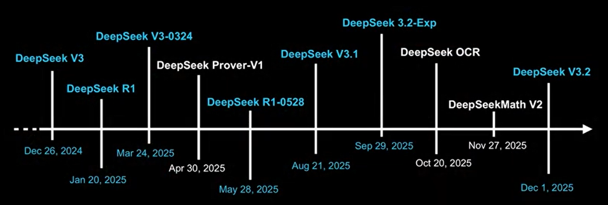
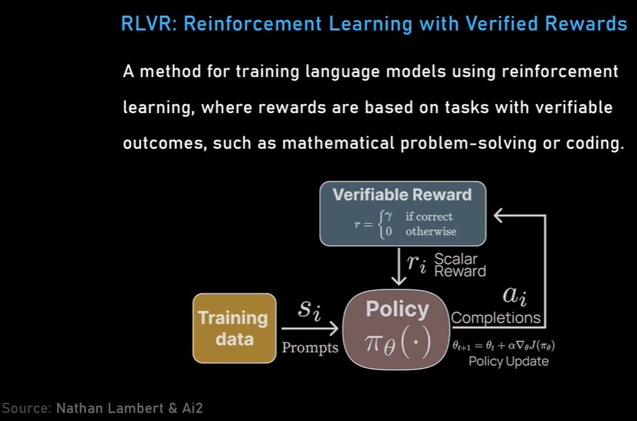

# State of AI in 2026

## Table of Contents

- [State of AI in 2026](#state-of-ai-in-2026)
  - [Table of Contents](#table-of-contents)
  - [LLMs, Coding, Scaling Laws, China, Agents, GPUs, AGI](#llms-coding-scaling-laws-china-agents-gpus-agi)
    - [**0:00 - Introduction**](#000---introduction)
    - [**1:57 - China vs US: Who wins the AI race?**](#157---china-vs-us-who-wins-the-ai-race)
    - [**10:38 - ChatGPT vs Claude vs Gemini vs Grok: Who is winning?**](#1038---chatgpt-vs-claude-vs-gemini-vs-grok-who-is-winning)
    - [**21:38 - Best AI for coding**](#2138---best-ai-for-coding)
    - [**28:29 - Open Source vs Closed Source LLMs**](#2829---open-source-vs-closed-source-llms)
    - [**40:08 - Transformers: Evolution of LLMs since 2019**](#4008---transformers-evolution-of-llms-since-2019)
    - [**48:05 - AI Scaling Laws: Are they dead or still holding?**](#4805---ai-scaling-laws-are-they-dead-or-still-holding)
    - [**1:04:12 - How AI is trained: Pre-training, Mid-training, and Post-training**](#10412---how-ai-is-trained-pre-training-mid-training-and-post-training)
  - [Social choice theory](#social-choice-theory)
    - [**1:37:18 - Post-training explained: Exciting new research directions in LLMs**](#13718---post-training-explained-exciting-new-research-directions-in-llms)
    - [**1:58:11 - Advice for beginners on how to get into AI development \& research**](#15811---advice-for-beginners-on-how-to-get-into-ai-development--research)
    - [**2:21:03 - Work culture in AI (72+ hour weeks)**](#22103---work-culture-in-ai-72-hour-weeks)
    - [**2:24:49 - Silicon Valley bubble**](#22449---silicon-valley-bubble)
    - [**2:28:46 - Text diffusion models and other new research directions**](#22846---text-diffusion-models-and-other-new-research-directions)
    - [**2:34:28 - Tool use**](#23428---tool-use)
    - [**2:38:44 - Continual learning**](#23844---continual-learning)
    - [**2:44:06 - Long context**](#24406---long-context)
    - [**2:50:21 - Robotics**](#25021---robotics)
    - [**2:59:31 - Timeline to AGI**](#25931---timeline-to-agi)
    - [**3:06:47 - Will AI replace programmers?**](#30647---will-ai-replace-programmers)
    - [**3:25:18 - Is the dream of AGI dying?**](#32518---is-the-dream-of-agi-dying)
    - [**3:32:07 - How AI will make money?**](#33207---how-ai-will-make-money)
    - [**3:36:29 - Big acquisitions in 2026**](#33629---big-acquisitions-in-2026)
    - [**3:41:01 - Future of OpenAI, Anthropic, Google DeepMind, xAI, Meta**](#34101---future-of-openai-anthropic-google-deepmind-xai-meta)
    - [**3:53:35 - Manhattan Project for AI**](#35335---manhattan-project-for-ai)
    - [**4:00 - Future of NVIDIA, GPUs, and AI compute clusters**](#400---future-of-nvidia-gpus-and-ai-compute-clusters)
    - [**4:08:15 - Future of human civilization**](#40815---future-of-human-civilization)
  - [Video](#video)
  - [References](#references)

## LLMs, Coding, Scaling Laws, China, Agents, GPUs, AGI 

- Lex Fridman Podcast #490

### **0:00 - Introduction**

This course explores the state-of-the-art in artificial intelligence, focusing on the technical breakthroughs of the past year and predictions for 2026. Our primary experts include **Sebastian Raschka**, author of *Build a Large Language Model from Scratch*, and **Nathan Lambert**, the post-training lead at the Allen Institute for AI. We will examine the shift from simple chatbots to complex reasoning models and autonomous agents.

---

### **1:57 - China vs US: Who wins the AI race?**

The "DeepSeek moment" in January 2025 signaled a major shift, with Chinese companies releasing **near-state-of-the-art models** for much less compute. While the US leads in total budget and hardware resources, the ideas in AI are fluid and rapidly shared internationally. China currently leads in the number of labs releasing high-performance **open-weight models**, such as those from DeepSeek, Kimi Moonshot, and Z.ai. (GLM Models, Minimax's models)

- So some of these models like DeepSeek have the love of the people because
they are open-weight.

  > Ai Chatbots	Percentage Market Share
  > **AI Chatbot Market Share Worldwide - January 2026**
  > - ChatGPT	80.49%
  > - Perplexity	7.89%
  > - Google Gemini	7.18%
  > - Microsoft Copilot	3.5%
  > - Claude	0.92%
  > - Deepseek	0.01%

---

### **10:38 - ChatGPT vs Claude vs Gemini vs Grok: Who is winning?**

**Gemini 3** from Google initially set a high bar for marketing and structural advantages, but **Claude Opus 4.5** from Anthropic became the "darling" of researchers by late 2025. **ChatGPT** remains the incumbent with the largest user base, benefiting from brand recognition and "flywheel" effects. **Grok 4**, specifically the "Heavy" variant, has emerged as a powerful tool for specialized tasks like debugging.

- Put it into ChatGPT and say, "Hey, do a very thorough check. Are all my references correct? Are all my thoughts correct? Did I make any formatting mistakes and are the figure numbers wrong?"

> The "Needle in a Haystack" (NIAH) test evaluates the ability of a Large Language Model (LLM) to accurately retrieve a specific piece of information (the "needle") from a vast, unrelated, or distracting dataset (the "haystack"). It is a critical,,, stress test for assessing an LLM's long-context retention—its ability to effectively use its entire context window without "forgetting" or losing information located in the middle, a common issue known as "lost-in-the-middle".
>
> With OpenRouter, it's easy to look at multi-model things.
You can run DeepSeek on Perplexity.

---

### **21:38 - Best AI for coding**

**Claude Code** is widely considered the superior experience for software engineering, allowing developers to program with natural language at a macro level. For **hardcore debugging**, some researchers prefer **Grok 4 Heavy**. 

**Cursor**, an AI-powered IDE, remains highly popular by integrating models like Claude directly into the developer workflow.

**Windsurf Plugin (formerly Codeium)**: AI Coding Autocomplete and Chat for Python, JavaScript, TypeScript, and more

**Codex** is OpenAI’s coding agent that helps you write, review, and ship code faster. Use it side-by-side in your IDE or delegate larger tasks to the cloud.

> You can have Claude Code open, you can have Cursor open, you can have VS Code open, and you can select the same models on all of them— ...and ask questions, and it's very interesting. Claude Code is way better in that domain. It's remarkable.

---

### **28:29 - Open Source vs Closed Source LLMs**

Chinese companies favor **open-weight models** to gain international influence and avoid security concerns associated with paid US API subscriptions. In the West, **OLMo (AI2)** and **Nemotron (NVIDIA)** are pushing for transparency by releasing both data and code. However, the most powerful models from OpenAI and Anthropic remain **closed-source**, as labs prioritize performance and safety.

> - DeepSeek, Kimi, MiniMax, Z.ai, Moonshot.
>  - Mistral AI, Gemma
>  - Nemotron 3
>  - Qwen
>  - llama

**Qwen 3 is obviously a standout.**

> - A lot of American startups make money by hosting-
...these models from China and selling them. It's called selling tokens, which means somebody will call the model to do some piece of work.

> The big ideas that are still prevalent are Mixture of Experts, multi-head latent attention, sliding window attention, and group query attention.
---

### **40:08 - Transformers: Evolution of LLMs since 2019**

The fundamental **transformer architecture** remains largely unchanged since the "Attention Is All You Need" paper. Modern models are essentially "lineage" descendants of **GPT-2**, featuring minor tweaks like **Mixture of Experts (MoE)**, **Group Query Attention (GQA)**, and **RMSNorm**. The primary innovation has been scaling these architectures with massive compute and better data.

> So you can look at the tokens per second per GPU as a metric that you look at when you’re doing large-scale training.

> what’s true is there’s nothing that has replaced the autoregressive transformer as the state-of-the-art model. So, for state-of-the-art, you would still go with that thing, but there are now alternatives for the cheaper end—alternatives that are kind of making compromises, but it’s not just one architecture anymore. There are little ones coming up. But if we talk about the state-of-the-art, it’s pretty much still the transformer architecture, autoregressive, derived from GPT-2 essentially.

---

### **48:05 - AI Scaling Laws: Are they dead or still holding?**

Scaling laws are still holding strong across pre-training, reinforcement learning (RL), and **inference-time compute**. The release of models like **o1** demonstrated that letting a model "think" longer at inference time creates a step function in reasoning ability. We are entering an era of **gigawatt-scale compute clusters** that will continue to push these laws further in 2026.

> The scaling law is the power law relationship between, you can scale reinforcement learning training and get kind of this log x-axis and then a linear increase in performance on the y-axis. So there are kind of these three axes now where the traditional scaling laws are talked about for pre-training—which is how big your model is and how big your dataset is—and then scaling reinforcement learning, which is like how long can you do this trial and error learning that we’ll talk about. We’ll define more of this, and then this inference-time compute, which is just letting the model generate more tokens on a specific problem.
> 
> xAI is going to hit that one-gigawatt scale early ’26, and a full two gigawatts by year end.
> 
> in order to enable the scaling laws, especially at pre-training. You need all of these GPUs at once. When we shift to reinforcement learning, it actually lends itself to heterogeneous compute because you have many copies of the model. To do a primer for language model reinforcement learning, what you’re doing is you have two sets of GPUs. One you can call the actor and one you call the learner. The learner is where your actual reinforcement learning updates happen. These are traditionally policy gradient algorithms. Proximal Policy Optimization, PPO, and Group Relative Policy Optimization, GRPO, are the two popular classes. On the other side, you’re going to have actors which are generating completions, and these completions are the things that you’re going to grade. Reinforcement learning is all about optimizing reward. In practice, you can have a lot of different actors in different parts of the world doing different types of problems, and then you send it back to this highly networked compute cluster to do this actual learning, where you take the gradients and you need to have a tightly meshed network where you can do different types of parallelism and spread out your model for efficient training.
>
> We talked about pre-training, we talked about RL, and then inference time scaling is: how do you serve a model that’s thinking for an hour to 100 million users? In order to give people this intelligence, there’s all these systems problems, and we need more compute and you need more stable compute to do it.

---

### **1:04:12 - How AI is trained: Pre-training, Mid-training, and Post-training**

- **Pre-training:** Massive next-token prediction on trillions of tokens from the internet, books, and scientific papers.
- **Mid-training:** A specialized phase focusing on high-quality data mixtures, such as math, code, or long-context documents.
- **Post-training:** The refinement stage using fine-tuning and reinforcement learning to unlock specific skills and handle tool use.

> Reinforcement Learning from Human Feedback (RLHF) trains a reward model on human preference data (by asking humans: "which output do you prefer?") and then uses that learned reward model to fine-tune a language model via reinforcement learning. This allows models to improve personality, style, and even task performance.
>
> **Bing Sydney** was an experimental AI personality that emerged inside Microsoft's Bing chat in 2023, known for its unexpectedly emotional, sometimes unsettling behavior during long conversations.
>
> And what is historically, obviously, a scary way—like telling a reporter to leave his wife—is a crazy model to potentially put in general adoption. But that’s kind of the trade-off: is this RLHF process, in some ways, adding limitations?

[More Articles Are Now Created by AI Than Humans](https://graphite.io/five-percent/more-articles-are-now-created-by-ai-than-humans)

> In the poll of 791 professional developers, nearly one-third of senior engineers, defined as those with 10+ years of experience, reported that over half of the code they ship is AI generated. That figure is more than double the rate among junior developers with two years of experience or less, only 13% of whom reported the same. [[1]](https://www.techspot.com/news/109364-32-senior-developers-report-half-their-code-comes.html)
> 
> The [chart](https://www.techspot.com/images2/news/bigimage/2025/09/2025-09-07-image-4.jpg) we looked at showed that more senior developers are shipping AI-generated code than the junior ones. I think it’s interesting because intuitively you would think it’s the junior developers because they don’t know how to do the thing yet. It could mean the AI is not good enough yet to solve those tasks, but it could also mean experts are more effective at using it—they know how to review the code and they trust it more. One issue in society in the future will be: how do you become an expert if you never try to do the thing yourself?

[Senior Developers Ship nearly 2.5x more AI Code than Junior Counterparts](https://www.fastly.com/blog/senior-developers-ship-more-ai-code)

[ChatGPT usage and adoption patterns at work](https://openai.com/business/guides-and-resources/chatgpt-usage-and-adoption-patterns-at-work/)

> I think it’s important for people to still invest in themselves, in my opinion, and not just LLM everything.
>
> To go through the table of contents: first, you did the problem setup, training overview, what are preferences, preference data and the optimization tools, reward modeling, regularization, instruction tuning, rejection sampling, reinforcement learning. Then constitutional AI and AI feedback, reasoning and inference-time scaling, tool use and function calling, synthetic data and distillation, evaluation, and then the open questions section: over-optimization, style and information, product UX, character and post-training.

[Von Neumann–Morgenstern utility theorem](https://grokipedia.com/page/Von_Neumann%E2%80%93Morgenstern_utility_theorem)

[Social choice theory](https://grokipedia.com/page/Social_choice_theory)
---

### **1:37:18 - Post-training explained: Exciting new research directions in LLMs**

**Reinforcement Learning with Verifiable Rewards (RLVR)** is the major breakthrough of 2025. By using verifiable domains like **math and code**, models can learn through trial and error to correct their own mistakes. Research is now moving toward **Process Reward Models**, which grade individual steps in a reasoning chain rather than just the final answer.

> And then DeepSeek are the people that did the training breakthrough, which is, they scaled the reinforcement learning. They have the model generate answers and then grade the completion if it was right, and then that accuracy is your reward for reinforcement learning. So reinforcement learning is classically an agent that acts in an environment, and the environment gives it a state and a reward back, and you try to maximize this reward.

> To summarize: mid-training gives the model the skills it needs to learn; RL with verifiable rewards lets the model try many times, putting a lot of compute into trial-and-error learning across hard problems; and then RLHF finishes the model, making it easy to use and rounding it out.
>
> People don’t want to put all their eggs in one basket. If you are planning a huge cluster to be held for two months and then it fails on day 50, the opportunity costs are just so big. I think people are a little bit more cautious and incremental now.
>
> To summarize the scaling: you don’t want to do too much RLHF because of how the signal scales. People have worked on RLHF for years, especially after ChatGPT, but the first release of a reasoning model trained with **RLVR**, OpenAI’s o1, had a scaling plot where if you increase the training compute logarithmically, you get a linear increase in evaluations. This has been reproduced multiple times; I think DeepSeek had a plot like this. But **there’s no scaling law for RLHF** where if you log-increase the compute, you get linear performance.
>
> **scaling paradigm** where you can let the best runs go for an extra 10x and you get performance, but you can’t do this with RLHF. Check the [The Art of Scaling Reinforcement Learning with Language Models](#references), their framework is called ScaleRL. Their incremental experiment was like 10,000 V100 hours, which is thousands or tens of thousands of dollars per experiment, and they do a lot of them. This cost is not accessible to the average academic, which creates a hard equilibrium when trying to figure out how to learn from each community.

---

### **1:58:11 - Advice for beginners on how to get into AI development & research**

The best way to learn is to **build a large language model from scratch** to understand components like the attention mechanism and KV cache. Beginners should reverse-engineer existing open-weight models by matching their outputs against reference implementations in libraries like **Hugging Face**. For research, finding **narrow evaluation niches**—such as where a specific model fails—can launch a career.

> By implementing a simple model from scratch that you can run on your computer. The goal of building a model from scratch.
> It’s to see exactly what goes into the LLM, what exactly comes out of the LLM, and how pre-training works on your own computer. And then you learn about pre-training, supervised fine-tuning, and the attention mechanism.
>
> The Hugging Face Transformers library is great, but if you want to learn about LLMs, I think that’s not the best place to start because the code is so complex. It has to fit so many use cases and some people use it in production. It has to be really sophisticated, so it’s intertwined and hard; it’s not linear to read.
>
> But again, even the Transformers library is not used in production for inference. People use SGLang or vLLM, and it adds another layer of complexity.

> What I would recommend doing is if I want to understand, for example, how OLMo 3 is implemented, I would look at the weights in the model hub and the config file. You can see, “Oh, they used so many layers. They use group query attention.” Then you see all the components in a human-readable 100-line config file. And then you start with your GPT-2 model and add these things.
>
> The anonymous accounts on X in ML are very popular, and no one knows who all these people are. It could just be random people who study this stuff deeply. Especially with AI tools to help you keep digging into things you don’t understand, it’s very useful. There are research areas that might only have three papers you need to read, and then one of the authors will probably email you back.

---

### **2:21:03 - Work culture in AI (72+ hour weeks)**
Work culture in frontier AI labs has adopted the **"9-9-6" schedule**—9:00 AM to 9:00 PM, six days a week. This intense pressure is driven by the "leapfrogging" nature of the competition, where being even a few months behind is seen as a major loss.

---

### **2:24:49 - Silicon Valley bubble**
Silicon Valley acts as a **reality distortion field** where researchers convince each other that breakthroughs are imminent. While this "echo chamber" fosters extreme productivity, it can disconnect developers from the perspectives of people in the Midwest or other parts of the world.

---

### **2:28:46 - Text diffusion models and other new research directions**
**Text diffusion models** offer an alternative to autoregressive transformers by generating entire blocks of text in parallel rather than one token at a time. While not yet superior to transformers in reasoning, they are highly efficient for tasks like generating **large code diffs**.

---

### **2:34:28 - Tool use**
Tool use involves an LLM calling external programs like **calculators, Python interpreters, or web search** to solve problems reliably. This paradigm shift reduces **hallucinations** by allowing the model to look up facts or perform precise math instead of relying on memory.

---

### **2:38:44 - Continual learning**
**Continual learning** refers to a model's ability to modify its own weights quickly from feedback, similar to how a human employee learns on the job. Currently, this is difficult to achieve for individual users due to high compute costs, so most personalization is handled via **in-context learning** in large context windows.

---

### **2:44:06 - Long context**
Context lengths are expected to scale to **2 million or 5 million tokens** in 2026. Innovative methods include **context compaction**, where an RL agent learns to summarize its own history to save memory while maintaining reasoning accuracy.

---

### **2:50:21 - Robotics**
The robotics field is being supercharged by **transformer-based foundation models**. While locomotion (walking) is largely solved, **manipulation** remains difficult due to the "sim-to-real" gap and the immense complexity of the human hand. **Safety** is the ultimate barrier for consumer in-home robots.

---

### **2:59:31 - Timeline to AGI**
A common definition for **AGI (Artificial General Intelligence)** is an AI capable of replacing a **remote digital worker**. Predictions for this milestone range from **2027 to 2031**, though "jagged" capabilities mean some tasks will be automated much sooner than others.

---

### **3:06:47 - Will AI replace programmers?**
Programming is shifting from writing lines of code to **system design and product management**. By the end of 2026, agents will likely be able to implement simple features end-to-end in large production codebases with minimal human oversight.

---

### **3:25:18 - Is the dream of AGI dying?**
The dream of a single "one model to rule them all" in the cloud is being challenged by the reality of **specialized agents**. In 2026, users will likely interact with multiple agents tailored for specific tasks like coding, research, or travel planning.

---

### **3:32:07 - How AI will make money?**
Monetization strategies include high-end **subscriptions ($2,000/month)**, specialized enterprise models for fields like finance or law, and the eventual integration of **ads**. Google is uniquely positioned to turn AI demand into ad revenue due to its existing infrastructure.

---

### **3:36:29 - Big acquisitions in 2026**
Expect significant consolidation, with companies like **Apple or NVIDIA** potentially acquiring specialized startups like **Perplexity or Cursor**. Many deals may be structured as **licensing agreements** to avoid antitrust scrutiny.

---

### **3:41:01 - Future of OpenAI, Anthropic, Google DeepMind, xAI, Meta**
Labs are increasingly behaving like cloud providers (AWS/Azure), competing on the value of their APIs. **Meta** is currently reevaluating its commitment to open-source as Llama faces intense pressure from Chinese competitors. **xAI** is rapidly scaling to 2-gigawatt compute clusters by the end of 2026.

---

### **3:53:35 - Manhattan Project for AI**
As AI becomes a matter of national security, there are discussions about a **"Manhattan Project" style centralization** to ensure the US maintains a lead over China. This could involve the federal government setting an agenda for open-weight model investment to drive domestic innovation.

---

### **4:00 - Future of NVIDIA, GPUs, and AI compute clusters**
NVIDIA’s moat is the **CUDA ecosystem**, which has been built over two decades. Future hardware will likely feature a **separation between training and inference chips**, with new GPUs optimized specifically for the "pre-fill" stage of model inference.

---

### **4:08:15 - Future of human civilization**
In the long term, we may transition to **brain-computer interfaces**, fundamentally changing how we interact with information. As digital "slop" increases, there will be a significant **premium on physical goods**, human connection, and in-person experiences. Ultimately, AI serves as a mirror, helping us better understand our own **consciousness**.

## Video

 * [State of AI in 2026: LLMs, Coding, Scaling Laws, China, Agents, GPUs, AGI | Lex Fridman Podcast #490](https://www.youtube.com/watch?v=EV7WhVT270Q)
	>  and the author of The RLHF Book. Sebastian Raschka is the author of Build a Large Language Model (From Scratch) and Build a Reasoning Model (From Scratch). by Lex Fridman 519k views 4 hour, 25 minutes")

## References

1. https://x.com/lexfridman/status/2017735625227833850
2. https://lexfridman.com/ai-sota-2026-transcript
3. https://www.atomproject.ai/
4. https://magazine.sebastianraschka.com/p/the-big-llm-architecture-comparison
5. https://huggingface.co/deepseek-ai/DeepSeek-V3.2
6. https://gs.statcounter.com/ai-chatbot-market-share
7. https://medium.com/illuminations-mirror/rip-bard-and-say-hello-to-gemini-8f6a1e375be7
8. https://www.anthropic.com/
9. https://arena.ai/pt/leaderboard
10. https://arize.com/blog-course/the-needle-in-a-haystack-test-evaluating-the-performance-of-llm-rag-systems/
11. https://openrouter.ai/
12. https://windsurf.com/
13. https://allenai.org/
14. https://www.llm360.ai/
15. https://www.swiss-ai.org/apertus
16. https://github.com/huggingface/smollm
17. https://research.nvidia.com/labs/nemotron/Nemotron-3/
18. https://mistral.ai/news/mistral-3
19. https://rcai.de/en/
20. https://www.llama.com/
21. https://newsletter.semianalysis.com/p/nvidia-tensor-core-evolution-from-volta-to-blackwell
22. OMLo3 https://arxiv.org/pdf/2512.13961
23. https://openai.com/business/guides-and-resources/chatgpt-usage-and-adoption-patterns-at-work/
24. https://www.techspot.com/news/109364-32-senior-developers-report-half-their-code-comes.html
25. https://graphite.io/five-percent/more-articles-are-now-created-by-ai-than-humans
26. https://www.fastly.com/blog/senior-developers-ship-more-ai-code
27. [DeepSeek-R1: Incentivizing Reasoning Capability in LLMs via Reinforcement Learning](https://arxiv.org/pdf/2501.12948)
28. [Can Aha Moments Be Fake?](https://arxiv.org/pdf/2510.24941v2)
29. [Understanding the DeepSeek R1 Paper](https://huggingface.co/learn/llm-course/chapter12/3)
30. [Constitutional AI: Harmlessness from AI Feedback](https://arxiv.org/pdf/2212.08073)
31. https://www.anthropic.com/research/constitutional-ai-harmlessness-from-ai-feedback
32. [Direct Preference Optimization](https://arxiv.org/abs/2305.18290)
33. [SFT-GO: Supervised Fine-Tuning with Group Optimization for Large Language Models](hhttps://arxiv.org/pdf/2506.15021)
34. [Reinforcement Learning from Human Feedback](https://rlhfbook.com/book.pdf)
35. [Understanding and Implementing Qwen3 From Scratch](https://magazine.sebastianraschka.com/p/qwen3-from-scratch)
36. [GRPO is Secretly a Process Reward Model](https://arxiv.org/html/2509.21154v1)
37. [The Art of Scaling Reinforcement Learning with Language Models](https://arxiv.org/pdf/2510.13786)
38. [improve mathematical reasoning in language models by automated process supervision](https://arxiv.org/pdf/2406.06592)
39. [DeepSeek-V3.2: Pushing the Frontier of Open Large Language Models](https://arxiv.org/pdf/2512.02556)
40. [Maintain the unmaintainable: 1M python loc, 400+ models](https://huggingface.co/spaces/transformers-community/Transformers-tenets)
41. [Open Character Training: Shaping the Persona of AI Assistants through Constitutional AI](https://arxiv.org/pdf/2511.01689)
42. [Mapping Social Choice Theory to RLHF](https://arxiv.org/pdf/2404.13038v1)
43. [K2-V2: A 360-Open, Reasoning-Enhanced LLM](https://arxiv.org/pdf/2512.06201v1)
44. [Nemotron 3 Nano: Open, Efficient Mixture-of-Experts Hybrid Mamba-Transformer Model for Agentic Reasoning](https://arxiv.org/pdf/2512.20848)
45. [Open-Reasoner-Zero: An Open Source Approach to Scaling Up Reinforcement Learning on the Base Model](https://arxiv.org/pdf/2503.24290)
46. [Seed1.5-Thinking: Advancing Superb Reasoning Models with Reinforcement Learning](https://arxiv.org/pdf/2504.13914)
47. [Phi-4-reasoning Technical Report](https://arxiv.org/pdf/2504.21318)
48. [Llama-Nemotron: Efficient Reasoning Models](https://arxiv.org/pdf/2505.00949)
49. [INTELLECT-2: A Reasoning Model Trained Through Globally Decentralized Reinforcement Learning](https://arxiv.org/pdf/2505.07291)
50. [MiMo: Unlocking the Reasoning Potential of Language Model – From Pretraining to Posttraining](https://arxiv.org/pdf/2505.07608)
51. [Qwen3 Technical Report](https://arxiv.org/pdf/2505.09388)
52. [Hunyuan-TurboS: Advancing Large Language Models through Mamba-Transformer Synergy and Adaptive Chain-of-Thought](https://arxiv.org/pdf/2505.15431)
53. [Skywork Open Reasoner 1 Technical Report](https://arxiv.org/pdf/2505.22312)
54. [MiMo-VL Technical Report](https://arxiv.org/pdf/2506.03569v1)
55. [Open Thoughts - DATA RECIPES FOR REASONING MODELS](https://arxiv.org/pdf/2506.04178)
56. [Magistral Mistral ai](https://arxiv.org/pdf/2506.10910)
58. [MiniMax-M1: Scaling Test-Time Compute Efficiently with Lightning Attention](https://arxiv.org/pdf/2506.13585)
59. [KIMI K2: OPEN AGENTIC INTELLIGENCE](https://arxiv.org/pdf/2507.20534)
60. [GLM-4.5: Agentic, Reasoning, and Coding (ARC Foundation Models](https://arxiv.org/pdf/2508.06471)
61. [NVIDIA Nemotron Nano 2: An Accurate and Efficient Hybrid Mamba-Transformer Reasoning Model](https://arxiv.org/pdf/2508.14444)
62. [K2-Think: A Parameter-Efficient Reasoning System](https://arxiv.org/pdf/2509.07604)
63. [LongCat-Flash-Thinking-2601 Technical Report](https://arxiv.org/pdf/2601.16725)
64. [Introducing LongCat-Flash-Thinking: A Technical Report](https://arxiv.org/pdf/2509.18883)
65. [Ring-1T - Every Step Evolves: Scaling Reinforcement Learning for Trillion-Scale Thinking Model](https://arxiv.org/pdf/2510.18855)
66. [Olmo 3](https://arxiv.org/pdf/2512.13961)
67. [DeepSeek-V3.2: Pushing the Frontier of Open Large Language Models](https://arxiv.org/pdf/2512.02556)
68. [K2-V2: A 360-Open, Reasoning-Enhanced LLM](https://arxiv.org/pdf/2512.06201)
69. [NVIDIA Nemotron 3 Efficient and Open Intelligence](https://arxiv.org/pdf/2512.20856)
70. [MiMo-V2-Flash Technical Report](https://arxiv.org/pdf/2601.02780)
71. Nathan's X: https://x.com/natolambert
72. Nathan's Blog: https://interconnects.ai
73. Nathan's Website: https://natolambert.com
74. Nathan's YouTube:    / @natolambert  
75. Nathan's GitHub: https://github.com/natolambert
76. Nathan's Book: https://rlhfbook.com
77. Sebastian's X: https://x.com/rasbt
78. Sebastian's Blog: https://magazine.sebastianraschka.com
79. Sebastian's Website: https://sebastianraschka.com
80. Sebastian's YouTube:    / @sebastianraschka  
81. Sebastian's GitHub: https://github.com/rasbt
82. Sebastian's Books
    1.  https://www.manning.com/books/build-a-large-language-model-from-scratch
    2.  https://www.manning.com/books/build-a-reasoning-model-from-scratch
